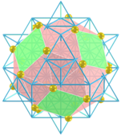
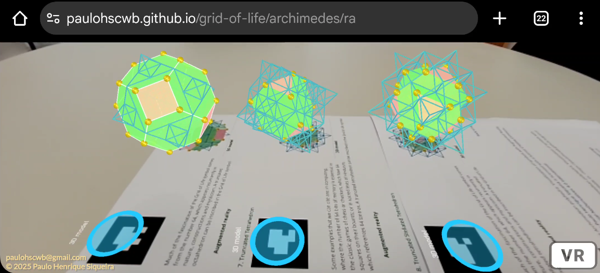
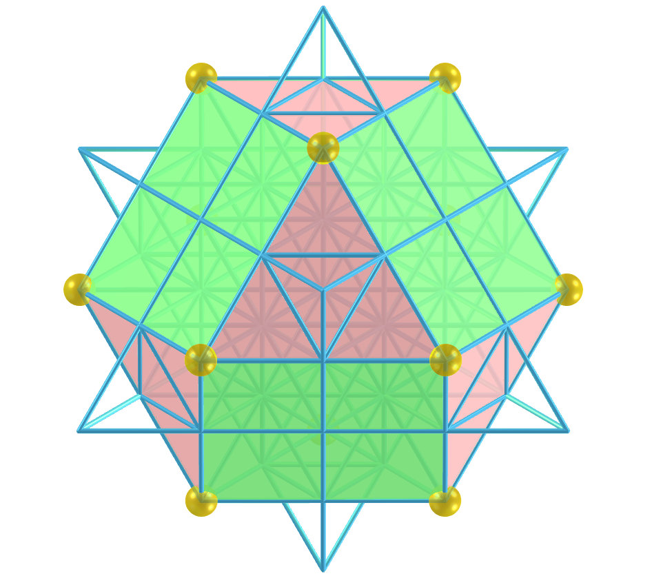
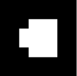
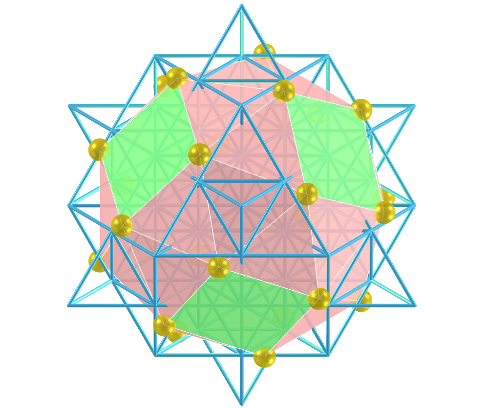
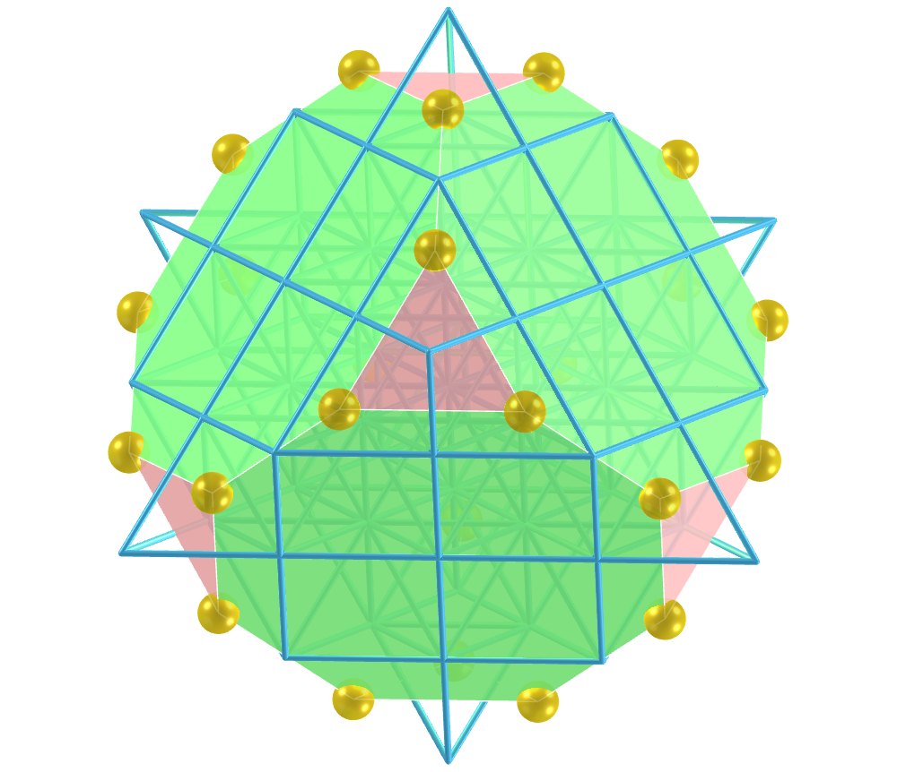
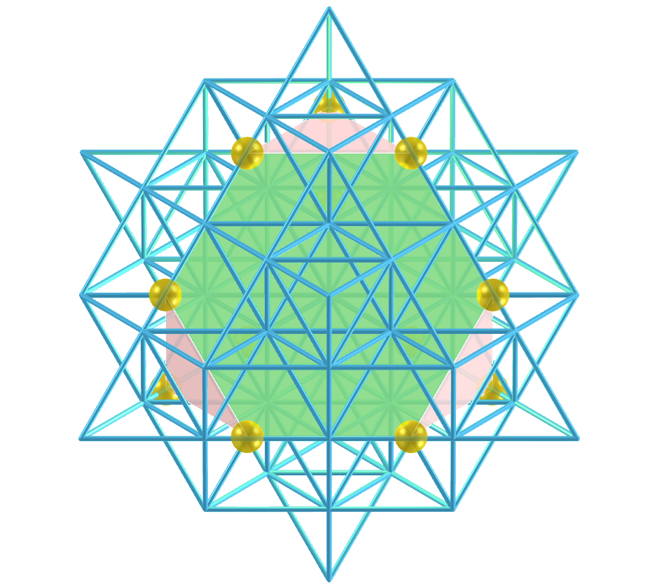
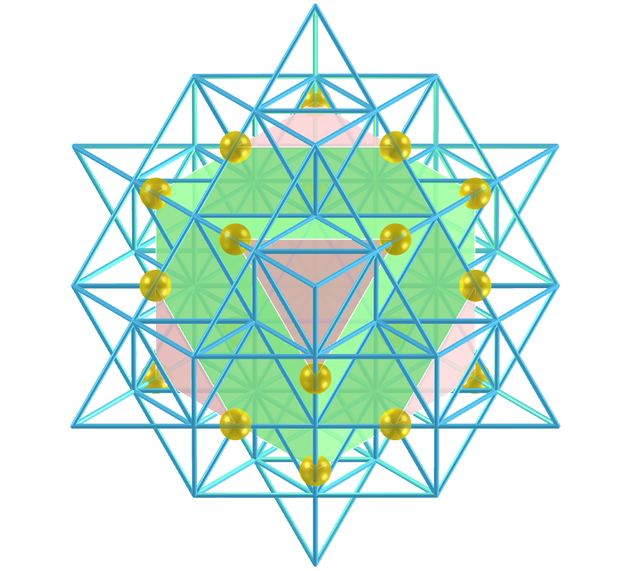

<link rel="stylesheet" href="../scripts/style.css">
<meta charset="utf-8">
<link rel="icon" type="image/png" href="vr/salas/imagens/icone.png">
<h2>Sacred Geometry: visualization of symbols with Augmented Reality (AR) and Virtual Reality (VR) in A-frame</h2>
 <b>author:</b> Paulo Henrique Siqueira - Universidade Federal do Paraná
  <b>contact:</b> <a href="#">paulohscwb@gmail.com</a>
  <a href="https://paulohscwb.github.io/grid-of-life/archimedes/pt-br/">versão em português</a>
 <form style="margin: 0 auto; float:right; text-align:right; width:100%; margin-bottom:15px;">
	<select id="url" onchange="urlHandler(this.value)" style="color:royalblue;">
		<option disabled selected value>More symbols:</option>
		<option disabled value="../archimedes/">Archimedean polyhedra</option>
		<!--<option value="../biscribed/">Biscribed polyhedr</option>
		<option value="../catalan/">Catalan polyhedra</option>
		<option value="../joined/">Archimedean and Catalan convex hulls</option>
		<option value="../nonconvex/">Nonconvex polyhedra</option>
		<option value="../propellor/">Propellor polyhedra</option>
		<option value="../toroids/">Polyhedral toroids</option>-->
	</select>
</form>

  <h2 align="center"> Grid of life and the Archimedean polyhedra</h2>
The symbol of the Grid of Life, also called tetrahedron 64, contrasts the Star Tetrahedron with the Flower of Life. We have 64 tetrahedra that form the Grid of Life symbol, which can be overlayed on the Flower of Life symbol, with the circles symbolizing the vastness of space and the interconnected lines indicating where space converges over time. 
This work shows Archimedean polyhedra inscribed or circumscribed in the symbol of the Grid of Life, with views that can be accessed with Augmented Reality resources and also in immersive Virtual Reality rooms.

<a href="#ra">Augmented Reality</a>&nbsp;&nbsp;|&nbsp;&nbsp;<a href="#m3d">3D Models</a>&nbsp;&nbsp;|&nbsp;&nbsp;<a href="../">Home</a>

  

 <h3 align="center">Immersive room</h3>
  
<iframe width="100%" src="sala.htm" title="Sala Imersiva dos poliedros de Arquimedes" frameborder="0" loading="lazy"></iframe>

  
<a href="sala.htm" target="_blank">&#x1f517; room link</a>
 
  

  <h3 id="ra" align="center">Augmented Reality</h3>
  To view Sacred Geometry symbols in AR, simply visit the pages indicated in the 3D solid models using any browser with a webcam device (smartphone, tablet or notebook).
 Access to the VR pages is done by clicking on the blue circle that appears on top of the marker.

<h3 id="m3d" align="center">3D models</h3>
<!--<iframe width="560" height="315" style="max-width:100%" src="https://www.youtube.com/embed/videoseries?list=PLy0I_lGW8HxUFFS5qIXC2KozRYcu06Jaq" title="YouTube video player" frameborder="0" allow="accelerometer; autoplay; clipboard-write; encrypted-media; gyroscope; picture-in-picture; web-share" allowfullscreen></iframe>-->
<h4>1. Cuboctahedron</h4>

    The Archimedes cuboctahedron represents the Energy Vector of Equilibrium. The cuboctahedron corresponds to the seventh circumference of the Seed of Life symbol and the vertices of this solid appear overlapping or in correspondence with some intersections of the Grid of Life symbol lines.
   
  
 

<h4>2. Rhombicuboctahedron</h4>

    Much of the fascination of the Grid of Life symbol comes from the number 64, which appears recurrently in nature, constructions and mysticism. a A rhombicuboctahedron can be inscribed in the Grid of Life symbol.
   
 

<h4>3. Snub Cube</h4>

    Some examples that we can cite are: in computing, where the number of 64 bits of memory is essential; in the classic games of chess or checkers, which have 64 squares on their boards; or in sacred texts of Hinduism, which references 64 tantras. A snub cube can be inscribed in the Grid of Life symbol.
   
 
 

<h4>4. Truncated Cube</h4>

    Much of the fascination of the Grid of Life symbol comes from the number 64, which appears recurrently in nature, constructions and mysticism. a A truncated cube can be inscribed in the Grid of Life symbol.
   
 

<h4>5. Truncated Cuboctahedron</h4>

    Some examples that we can cite are: in computing, where the number of 64 bits of memory is essential; in the classic games of chess or checkers, which have 64 squares on their boards; or in sacred texts of Hinduism, which references 64 tantras. A truncated cuboctahedron can be inscribed in the Grid of Life symbol.
   
  
 

<h4>6. Truncated Octahedron</h4>

    Much of the fascination of the Grid of Life symbol comes from the number 64, which appears recurrently in nature, constructions and mysticism. a A truncated octahedron can be inscribed in the Grid of Life symbol.
   
 
 

<h4>7. Truncated Tetrahedron</h4>

    Some examples that we can cite are: in computing, where the number of 64 bits of memory is essential; in the classic games of chess or checkers, which have 64 squares on their boards; or in sacred texts of Hinduism, which references 64 tantras. A truncated tetrahedron can be inscribed in the Grid of Life symbol.
   
  
 

<h4>8. Truncated Stellated Tetrahedron</h4>

    Much of the fascination of the Grid of Life symbol comes from the number 64, which appears recurrently in nature, constructions and mysticism. a A truncated stellated tetrahedron can be inscribed in the Grid of Life symbol.
   
 
 
<a href="#p1" class="topo">back to top</a>

  Grid of life and the Archimedean polyhedra: Visualization of symbols with Augmented Reality and Virtual Reality" by <a xmlns:cc="http://creativecommons.org/ns#" href="https://paulohscwb.github.io/grid-of-life/archimedes/" property="cc:attributionName" rel="cc:attributionURL">Paulo Henrique Siqueira</a> is licensed with a license <a rel="license" href="http://creativecommons.org/licenses/by-nc-nd/4.0/">Creative Commons Attribution-NonCommercial-NoDerivatives 4.0 International</a>.

<h4>How to cite this work:</h4> 

Siqueira, P.H., "Grid of life and the Archimedean polyhedra: Visualization of symbols with Augmented Reality and Virtual Reality"". Available in: <https://paulohscwb.github.io/grid-of-life/archimedes/>, February 2025.

<!---->
  <b>References:</b>
 Pardesco. "Sacred Geometry Art, Symbols & Meanings". <a href="https://pardesco.com/blogs/news/sacred-geometry-art-symbols-meanings" target="_blank">https://pardesco.com/blogs/news/sacred-geometry-art-symbols-meanings</a>
 Weisstein, Eric W. "Polyhedra" From MathWorld-A Wolfram Web Resource. <a href="https://mathworld.wolfram.com/topics/Polyhedra.html" target="_blank">https://mathworld.wolfram.com/topics/Polyhedra.html</a>
 Wikipedia <a href="https://en.wikipedia.org/wiki/en.wikipedia.org/wiki/Platonic_solid" target="_blank">https://en.wikipedia.org/wiki/Platonic_solid</a>
 Solar System Scope. "Solar Textures: Stars and Milky Way". <a href="http://dmccooey.com/polyhedra/" target="_blank">https://www.solarsystemscope.com/textures/</a>
