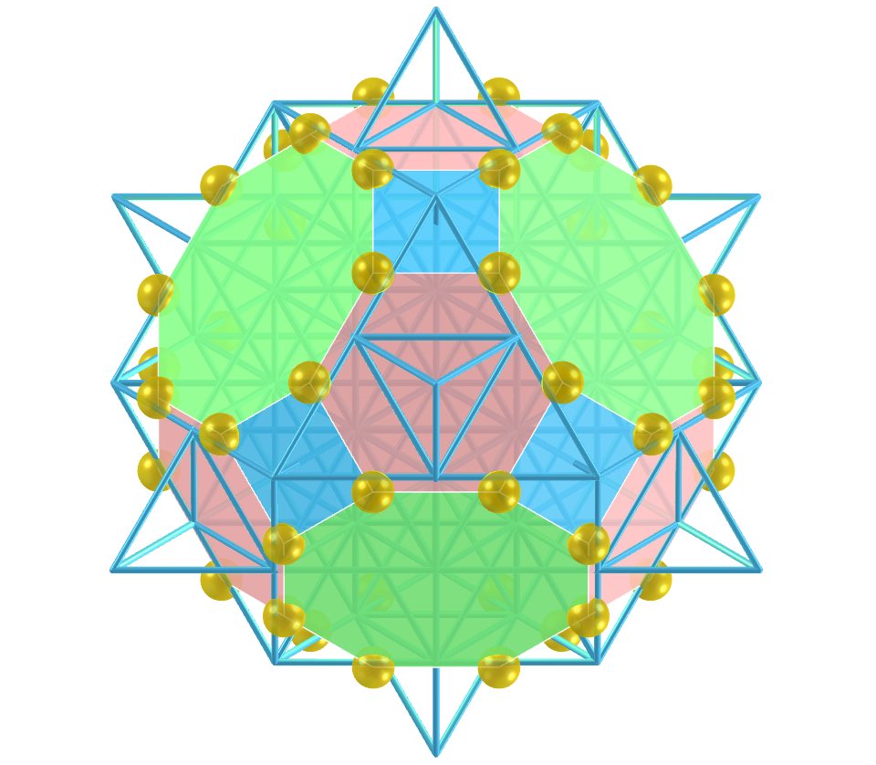
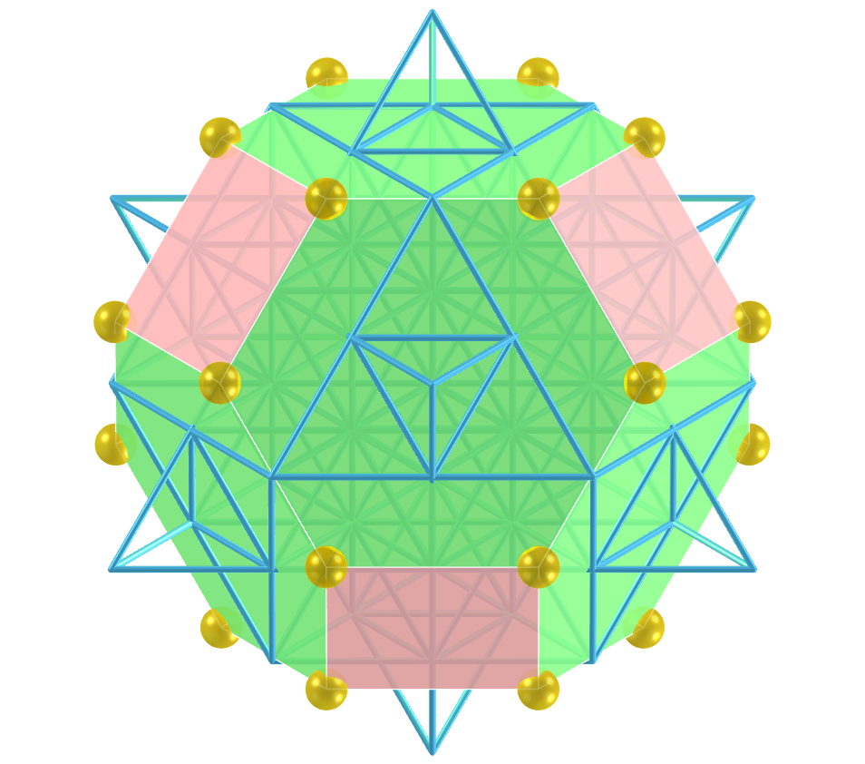

<link rel="stylesheet" href="../../scripts/style.css">
<meta charset="utf-8">
<link rel="icon" type="image/png" href="../vr/salas/imagens/icone.png">
<h2>Visualização de poliedros no símbolo da Grade da Vida com Realidade Aumentada (RA) e Realidade Virtual (RV) em A-frame</h2>
<b>autor:</b> Paulo Henrique Siqueira - Universidade Federal do Paraná
 <b>contato:</b> <a href="#"> paulohscwb@gmail.com </a>
 <a href="https://paulohscwb.github.io/grid-of-life/archimedes/">english version</a>
<form style="margin: 0 auto; float:right; text-align:right; width:100%; margin-bottom:15px;">
	<select id="url" onchange="urlHandler(this.value)" style="color:royalblue;">
		<option disabled selected>Mais símbolos:</option>
		<option disabled value="../../archimedes/pt-br/">Poliedros de Arquimedes</option>
		<!--<option value="../../biscribed/pt-br/">Poliedros biscritos</option>
		<option value="../../catalan/pt-br/">Poliedros de Catalan</option>
		<option value="../../joined/pt-br/">Cascos convexos de Arquimedes e de Catalan</option>
		<option value="../../nonconvex/pt-br/">Poliedros não convexos</option>
		<option value="../../propellor/pt-br/">Poliedros de hélice</option>
		<option value="../../toroids/pt-br/">Toroides poliédricos</option>-->
	</select>
</form>

  <h2 align="center"> Grade da vida e os poliedros de Arquimedes</h2>
   O símbolo da Grade da Vida, também denominado tetraedro 64, contrapõe o Tetraedro Estrelado com a Flor da Vida. Temos 64 tetraedros que formam o símbolo da Grade da Vida, que pode ser sobreposto ao símbolo da Flor da Vida, com os círculos simbolizando a vastidão do espaço e as linhas interligadas indicando onde o espaço converge com o tempo.
Este trabalho mostra poliedros de Arquimedes inscritos ou circunscritos no símbolo da Grade da vida, com as visualizações que podem ser acessadas com os recursos de Realidade Aumentada e também em salas imersivas de Realidade Virtual.
 
<a href="#ra">Realidade Aumentada</a>&nbsp;&nbsp;|&nbsp;&nbsp;<a href="#m3d">Modelos 3D</a>&nbsp;&nbsp;|&nbsp;&nbsp;<a href="../../pt-br/">Página Inicial</a>

 <h3 align="center">Sala imersiva</h3>
  
<iframe width="100%" src="../sala.htm" title="Sala Imersiva dos poliedros de Arquimedes" frameborder="0" loading="lazy"></iframe>

  
<a href="../sala.htm" target="_blank">&#x1f517; room link</a>
 
  

  <h3 id="ra" align="center">Realidade Aumentada</h3>
  Para visualizar os símbolos da Geometria Sagrada em RA, visite as páginas indicadas nos modelos 3D dos sólidos utilizando qualquer navegador com um dispositivo de webcam (smartphone, tablet ou notebook).
O acesso às páginas de RV é feito clicando no círculo azul que aparece em cima de cada marcador.
 O acesso às páginas de RV é feito clicando no círculo azul que aparece em cima de cada marcador.

<h3 id="m3d" align="center">Modelos 3D</h3>
<iframe width="560" height="315" style="max-width:100%" src="https://www.youtube.com/embed/videoseries?list=PLy0I_lGW8HxUnQp7BMJS5m8ATRTtQvhIW" title="YouTube video player" frameborder="0" allow="accelerometer; autoplay; clipboard-write; encrypted-media; gyroscope; picture-in-picture; web-share" allowfullscreen></iframe>
<h4>1. Cuboctaedro</h4>

    O cuboctaedro de Arquimedes representa o Vetor de Equilíbrio de energia. O cuboctaedro corresponde à sétima circunferência do símbolo da Semente da Vida e os vértices deste sólido aparecem sobrepostos ou com correspondência a algumas interseções das linhas do símbolo da Grade da Vida.
    

<h4>2. Rombicuboctaedro</h4>

    Grande parte do fascínio do símbolo da Grade da Vida vem do número 64, que surge recorrentemente na natureza, nas construções e no misticismo. Um rombicuboctaedro pode ser inscrito no símbolo da Grade da Vida.
    

<h4>3. Cubo Snub</h4>

    Alguns exemplos que podemos citar são: na computação, onde o número de 64 bits de memória é essencial; nos jogos clássicos de xadrez ou damas, que possuem 64 casas em seus tabuleiros; ou em textos sagrados do Hinduísmo, que faz referência a 64 tantras. Um cubo snub pode ser inscrito no símbolo da Grade da Vida.
    

<h4>4. Cubo Truncado</h4>

    Grande parte do fascínio do símbolo da Grade da Vida vem do número 64, que surge recorrentemente na natureza, nas construções e no misticismo. Um cubo truncado pode ser inscrito no símbolo da Grade da Vida.
    

<h4>5. Cuboctaedro Truncado</h4>

    Alguns exemplos que podemos citar são: na computação, onde o número de 64 bits de memória é essencial; nos jogos clássicos de xadrez ou damas, que possuem 64 casas em seus tabuleiros; ou em textos sagrados do Hinduísmo, que faz referência a 64 tantras. Um cuboctaedro truncado pode ser inscrito no símbolo da Grade da Vida.
    

<h4>6. Octaedro Truncado</h4>

    Grande parte do fascínio do símbolo da Grade da Vida vem do número 64, que surge recorrentemente na natureza, nas construções e no misticismo. Um octaedro truncado pode ser inscrito no símbolo da Grade da Vida.
    

<h4>7. Tetraedro Truncado</h4>

    Alguns exemplos que podemos citar são: na computação, onde o número de 64 bits de memória é essencial; nos jogos clássicos de xadrez ou damas, que possuem 64 casas em seus tabuleiros; ou em textos sagrados do Hinduísmo, que faz referência a 64 tantras. Um tetraedro truncado pode ser inscrito no símbolo da Grade da Vida.
    

<h4>8. Tetraedro Truncado Estrelado</h4>

    Grande parte do fascínio do símbolo da Grade da Vida vem do número 64, que surge recorrentemente na natureza, nas construções e no misticismo. Um tetraedro truncado estrelado pode ser inscrito no símbolo da Grade da Vida.
    

<a href="#p1" class="topo">voltar ao topo</a>

  Grid of life and the Archimedean polyhedra: Visualization of symbols with Augmented Reality and Virtual Reality de <a xmlns:cc="http://creativecommons.org/ns#" href="https://paulohscwb.github.io/grid-of-life/archimedes/pt-br/" property="cc:attributionName" rel="cc:attributionURL">Paulo Henrique Siqueira</a> está licenciado com uma Licença <a rel="license" href="http://creativecommons.org/licenses/by-nc-nd/4.0/">Creative Commons Atribuição-NãoComercial-SemDerivações 4.0 Internacional</a>.

<h4>Como citar este trabalho:</h4> 

Siqueira, P.H., "Grid of life and the Archimedean polyhedra: Visualization of symbols with Augmented Reality and Virtual Reality". Disponível em: <https://paulohscwb.github.io/grid-of-life/archimedes/pt-br/>, Fevereiro de 2025.

<!---->
  <b>Referências:</b>
 Pardesco. "Sacred Geometry Art, Symbols & Meanings". <a href="https://pardesco.com/blogs/news/sacred-geometry-art-symbols-meanings" target="_blank">https://pardesco.com/blogs/news/sacred-geometry-art-symbols-meanings</a>
 Weisstein, Eric W. "Polyhedra" From MathWorld-A Wolfram Web Resource. <a href="https://mathworld.wolfram.com/topics/Polyhedra.html" target="_blank">https://mathworld.wolfram.com/topics/Polyhedra.html</a>
 Wikipedia <a href="https://en.wikipedia.org/wiki/en.wikipedia.org/wiki/Platonic_solid" target="_blank">https://en.wikipedia.org/wiki/Platonic_solid</a>
 Solar System Scope. "Solar Textures: Stars and Milky Way". <a href="http://dmccooey.com/polyhedra/" target="_blank">https://www.solarsystemscope.com/textures/</a>
