<link rel="stylesheet" href="../../scripts/style.css">
<meta charset="utf-8">
<link rel="icon" type="image/png" href="../vr/salas/imagens/icone.png">
<h2>Visualização de poliedros no símbolo da Grade da Vida com Realidade Aumentada (RA) e Realidade Virtual (RV) em A-frame</h2>
<b>autor:</b> Paulo Henrique Siqueira - Universidade Federal do Paraná
 <b>contato:</b> <a href="#"> paulohscwb@gmail.com </a>
 <a href="https://paulohscwb.github.io/grid-of-life/nonconvex/">english version</a>
<form style="margin: 0 auto; float:right; text-align:right; width:100%; margin-bottom:15px;">
	<select id="url" onchange="urlHandler(this.value)" style="color:royalblue;">
		<option disabled selected>Mais poliedros:</option>
		<option value="../../archimedes/pt-br/">Poliedros de Arquimedes</option>
		<!--<option value="../../biscribed/pt-br/">Poliedros biscritos</option>-->
		<option value="../../catalan/pt-br/">Poliedros de Catalan</option>
		<option value="../../joined/pt-br/">Cascos convexos de Arquimedes e de Catalan</option>
		<option disabled value="../../nonconvex/pt-br/">Poliedros não convexos</option>
		<!--<option value="../../propellor/pt-br/">Poliedros de hélice</option>
		<option value="../../toroids/pt-br/">Toroides poliédricos</option>-->
	</select>
</form>

  <h2 align="center">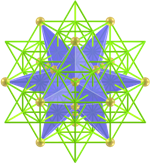 Grade da vida e os poliedros não convexos</h2>
   O símbolo da Grade da Vida, também denominado tetraedro 64, contrapõe o Tetraedro Estrelado com a Flor da Vida. Temos 64 tetraedros que formam o símbolo da Grade da Vida, que pode ser sobreposto ao símbolo da Flor da Vida, com os círculos simbolizando a vastidão do espaço e as linhas interligadas indicando onde o espaço converge com o tempo.
 Este trabalho mostra poliedros não convexos inscritos ou circunscritos no símbolo da Grade da vida, com as visualizações que podem ser acessadas com os recursos de Realidade Aumentada e também em salas imersivas de Realidade Virtual.
 
<a href="#ra">Realidade Aumentada</a>&nbsp;&nbsp;|&nbsp;&nbsp;<a href="#m3d">Modelos 3D</a>&nbsp;&nbsp;|&nbsp;&nbsp;<a href="../../pt-br/">Página Inicial</a>

 <h3 align="center">Salas imersivas</h3>
  
<iframe width="100%" src="../sala.htm" title="Grid of life - VR immersive room" frameborder="0" loading="lazy"></iframe>

  

  
<a href="../sala.htm" target="_blank">&#x1f517; sala 1</a>&nbsp;&nbsp;|&nbsp;&nbsp;<a href="../sala1.htm" target="_blank">&#x1f517; sala 2</a>&nbsp;&nbsp;|&nbsp;&nbsp;<a href="../sala2.htm" target="_blank">&#x1f517; sala 3</a>
 
  

  <h3 id="ra" align="center">Realidade Aumentada</h3>
  Para visualizar os símbolos da Geometria Sagrada em RA, visite as páginas indicadas nos modelos 3D dos sólidos utilizando qualquer navegador com um dispositivo de webcam (smartphone, tablet ou notebook).
 O acesso às páginas de RV é feito clicando no círculo azul que aparece em cima de cada marcador.

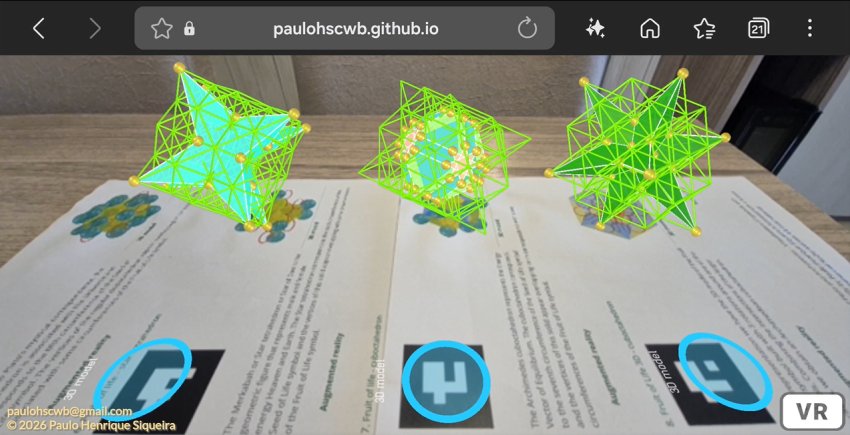

<h3 id="m3d" align="center">Modelos 3D</h3>
<!--<iframe width="560" height="315" style="max-width:100%" src="https://www.youtube.com/embed/videoseries?list=PLy0I_lGW8HxXtlU9Y-VgIXEvkTGrlRsG4" title="YouTube video player" frameborder="0" allow="accelerometer; autoplay; clipboard-write; encrypted-media; gyroscope; picture-in-picture; web-share" allowfullscreen></iframe>-->
<h4>1. Dodecaedro côncavo</h4>
<a href="../vr/ConcaveDodecahedron.htm" target="_blank" title="modelo 3D" class="fotoA">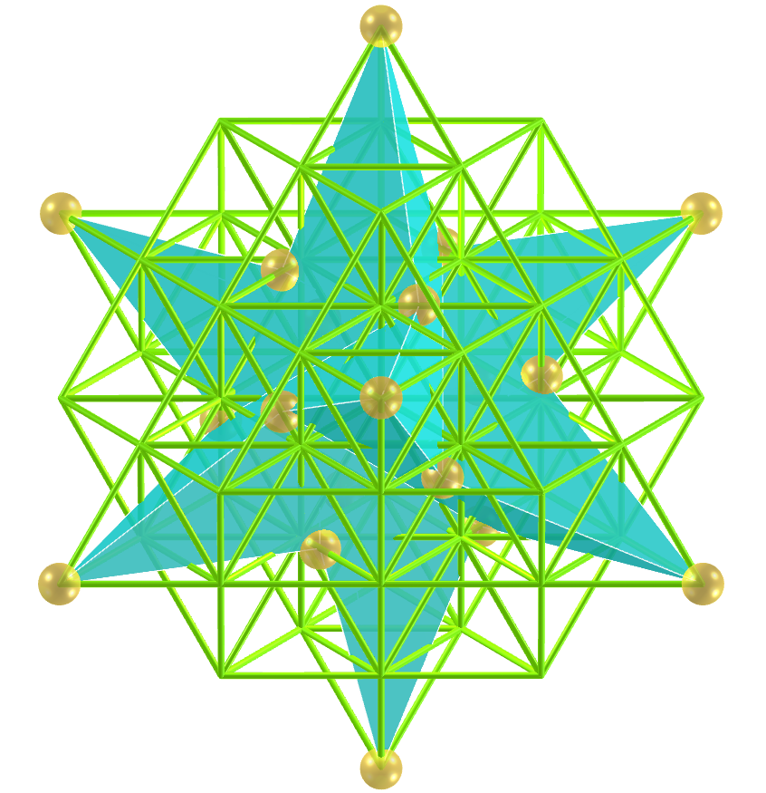</a>
    Alguns exemplos que podemos citar são: na computação, onde o número de 64 bits de memória é essencial; nos jogos clássicos de xadrez ou damas, que possuem 64 casas em seus tabuleiros; ou em textos sagrados do Hinduísmo, que faz referência a 64 tantras. Um dodecaedro côncavo pode ser inscrito no símbolo da Grade da Vida.
    

<h4>2. Cuboctaedro cubitruncado</h4>
<a href="../vr/CubitruncatedCuboctahedron.htm" target="_blank" title="modelo 3D" class="fotoA">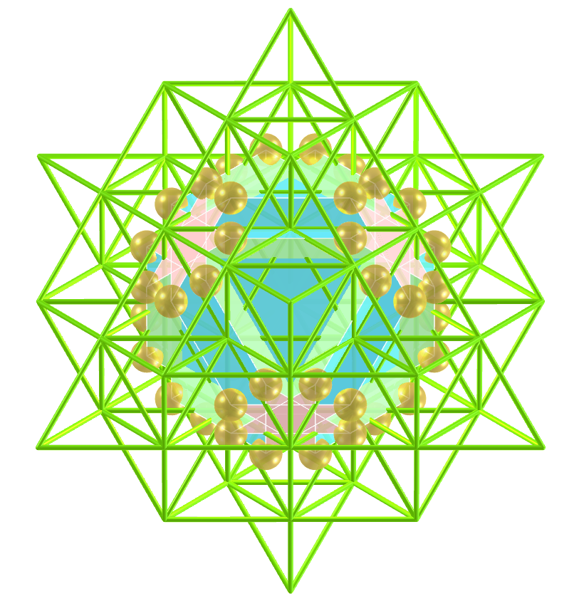</a>
    Grande parte do fascínio do símbolo da Grade da Vida vem do número 64, que surge recorrentemente na natureza, nas construções e no misticismo. Um cuboctaedro cubitruncado pode ser inscrito no símbolo da Grade da Vida.
    

<h4>3. Cubo com pipas</h4>
<a href="../vr/cubo_kites.htm" target="_blank" title="modelo 3D" class="fotoA">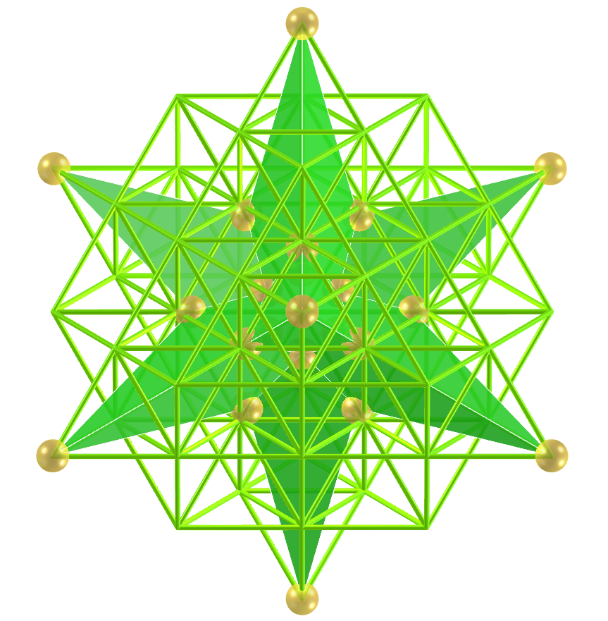</a>
    Alguns exemplos que podemos citar são: na computação, onde o número de 64 bits de memória é essencial; nos jogos clássicos de xadrez ou damas, que possuem 64 casas em seus tabuleiros; ou em textos sagrados do Hinduísmo, que faz referência a 64 tantras. Um cubo com pipas pode ser inscrito no símbolo da Grade da Vida.
    

<h4>4. Cubohemioctaedro</h4>
<a href="../vr/Cubohemioctahedron.htm" target="_blank" title="modelo 3D" class="fotoA">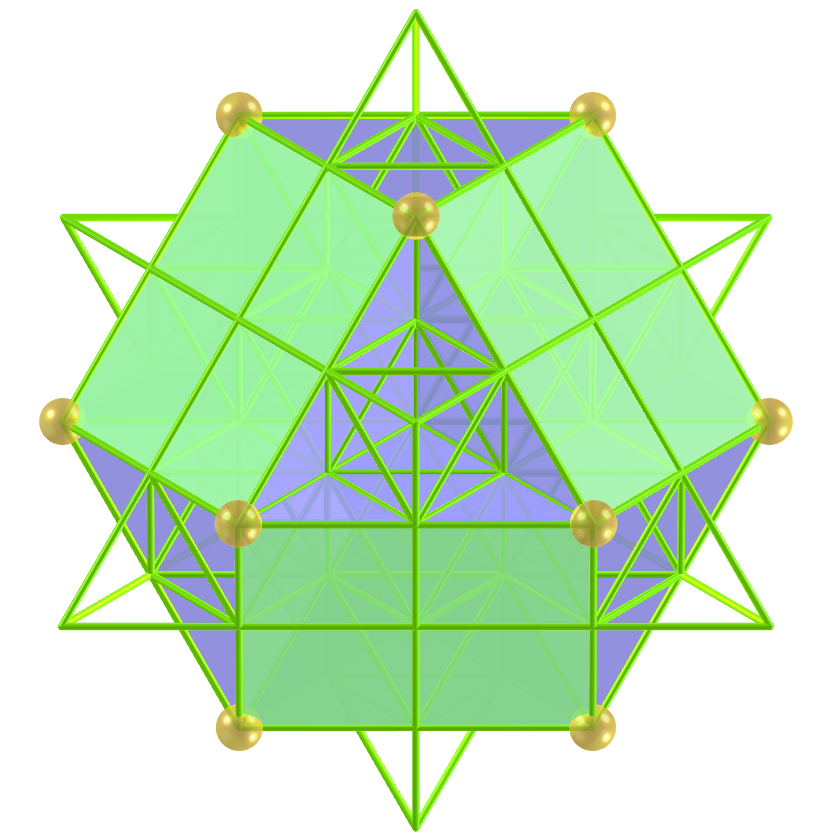</a>
    Grande parte do fascínio do símbolo da Grade da Vida vem do número 64, que surge recorrentemente na natureza, nas construções e no misticismo. Um cubohemioctaedro pode ser inscrito no símbolo da Grade da Vida.
    

<h4>5. Dodecaedro com pipas</h4>
<a href="../vr/dode_kites.htm" target="_blank" title="modelo 3D" class="fotoA">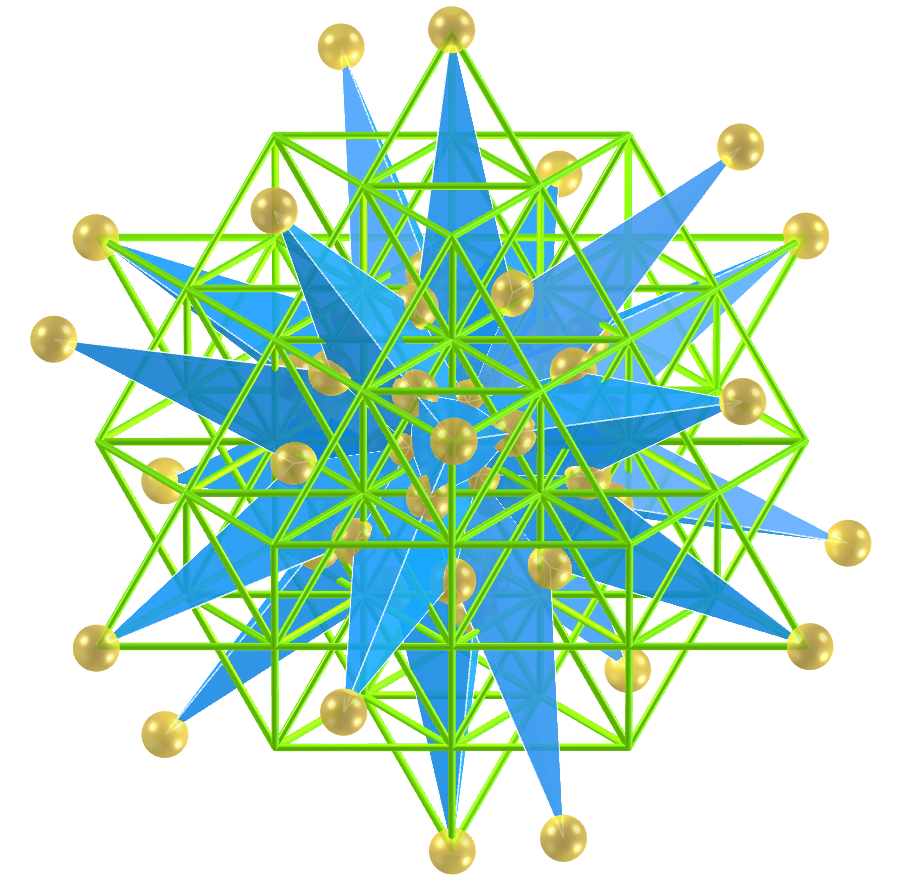</a>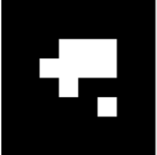
    Alguns exemplos que podemos citar são: na computação, onde o número de 64 bits de memória é essencial; nos jogos clássicos de xadrez ou damas, que possuem 64 casas em seus tabuleiros; ou em textos sagrados do Hinduísmo, que faz referência a 64 tantras. Um dodecaedro com pipas pode ser circunscrito no símbolo da Grade da Vida.
    

<h4>6. Sólido de Escher</h4>
<a href="../vr/Escher.htm" target="_blank" title="modelo 3D" class="fotoA">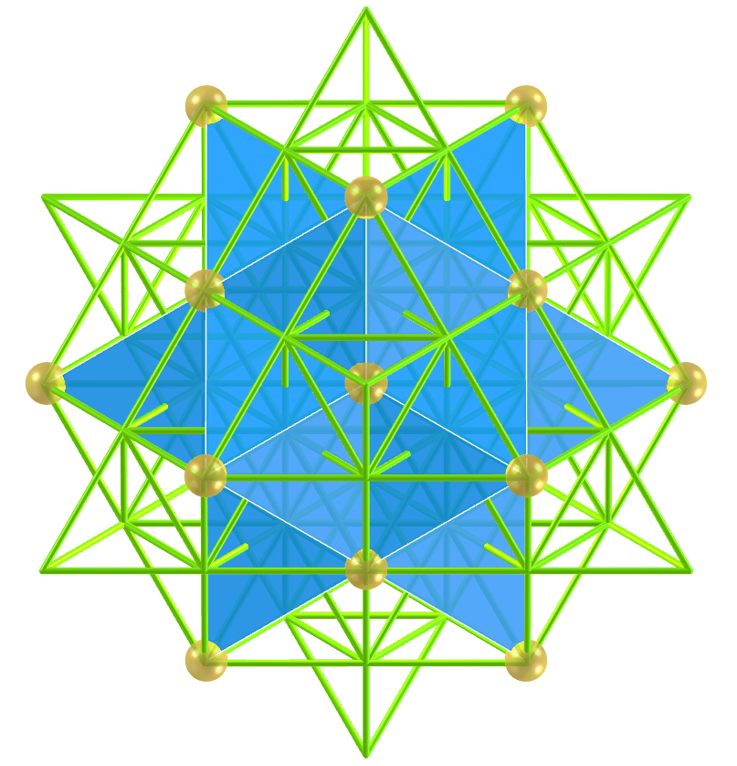</a>
    Grande parte do fascínio do símbolo da Grade da Vida vem do número 64, que surge recorrentemente na natureza, nas construções e no misticismo. Um sólido de Escher pode ser inscrito no símbolo da Grade da Vida.
    

<h4>7. Dual do sólido de Escher</h4>
<a href="../vr/EscherDual.htm" target="_blank" title="modelo 3D" class="fotoA">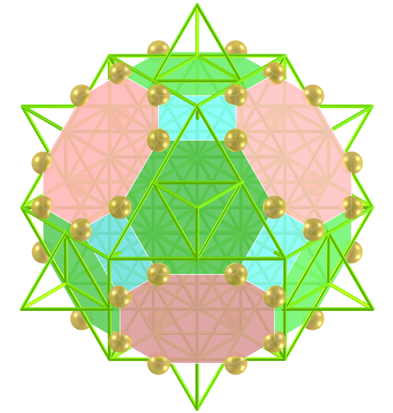</a>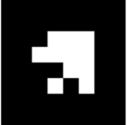
    Alguns exemplos que podemos citar são: na computação, onde o número de 64 bits de memória é essencial; nos jogos clássicos de xadrez ou damas, que possuem 64 casas em seus tabuleiros; ou em textos sagrados do Hinduísmo, que faz referência a 64 tantras. Um dual do sólido de Escher pode ser inscrito no símbolo da Grade da Vida.
    

<h4>8. Grande cubicuboctaedro</h4>
<a href="../vr/GreatCubicuboctahedron.htm" target="_blank" title="modelo 3D" class="fotoA">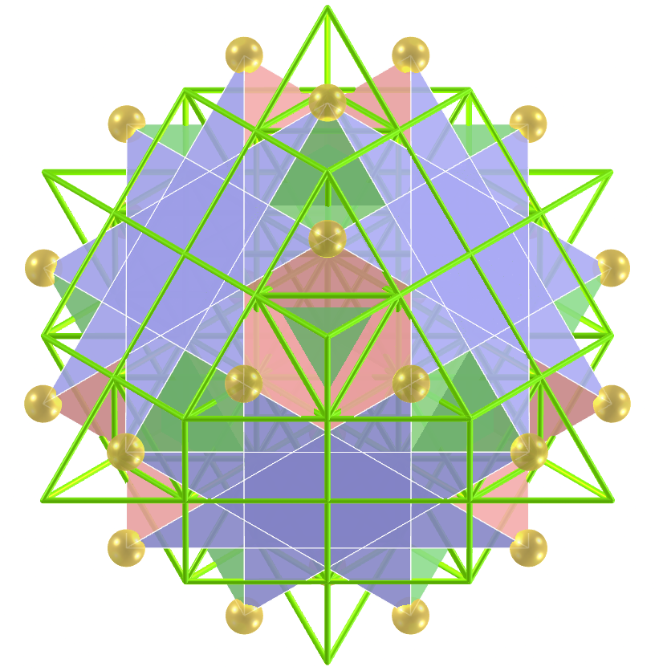</a>
    Grande parte do fascínio do símbolo da Grade da Vida vem do número 64, que surge recorrentemente na natureza, nas construções e no misticismo. Um grande cubicuboctaedro pode ser inscrito no símbolo da Grade da Vida.
    

<h4>9. Grande icositetraedro deltoidal</h4>
<a href="../vr/GreatDeltoidalIcositetrahedron.htm" target="_blank" title="modelo 3D" class="fotoA">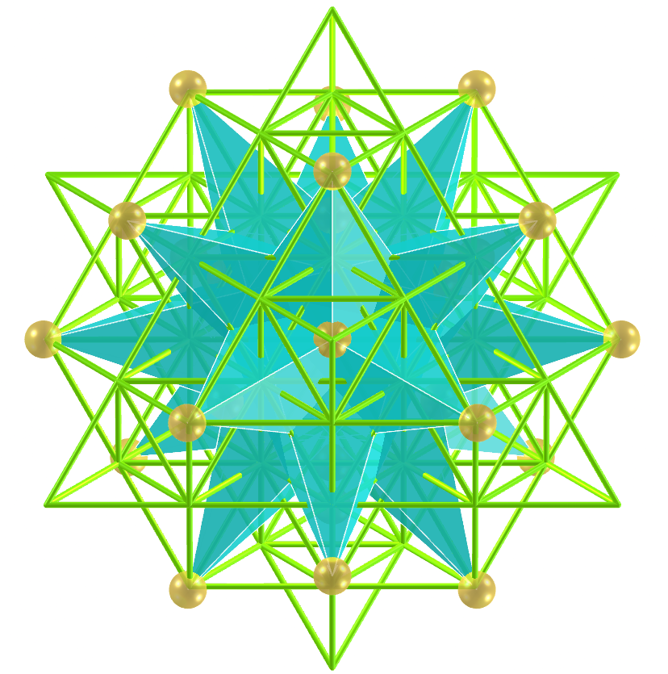</a>
    Alguns exemplos que podemos citar são: na computação, onde o número de 64 bits de memória é essencial; nos jogos clássicos de xadrez ou damas, que possuem 64 casas em seus tabuleiros; ou em textos sagrados do Hinduísmo, que faz referência a 64 tantras. Um grande icositetraedro deltoidal pode ser inscrito no símbolo da Grade da Vida.
    

<h4>10. Grande dodecaedron disdiakis</h4>
<a href="../vr/GreatDisdyakisDodecahedron.htm" target="_blank" title="modelo 3D" class="fotoA">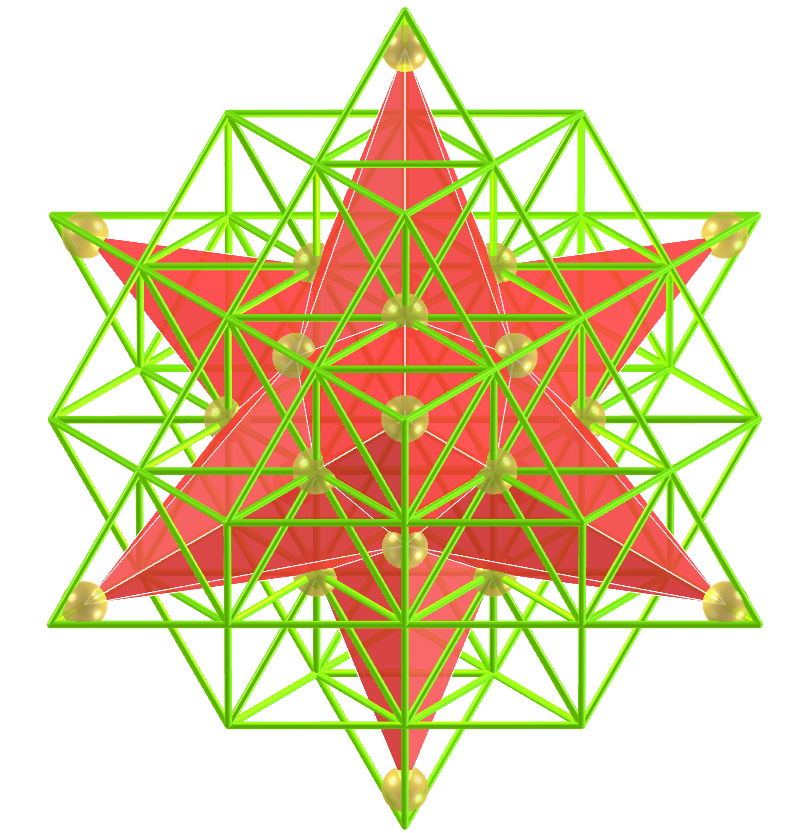</a>
    Grande parte do fascínio do símbolo da Grade da Vida vem do número 64, que surge recorrentemente na natureza, nas construções e no misticismo. Um grande dodecaedron disdiakis pode ser inscrito no símbolo da Grade da Vida.
    

<a href="#p1" class="topo">voltar ao topo</a>

<h4>11. Grande icositetraedro hexacrônico</h4>
<a href="../vr/GreatHexacronicIcositetrahedron.htm" target="_blank" title="modelo 3D" class="fotoA">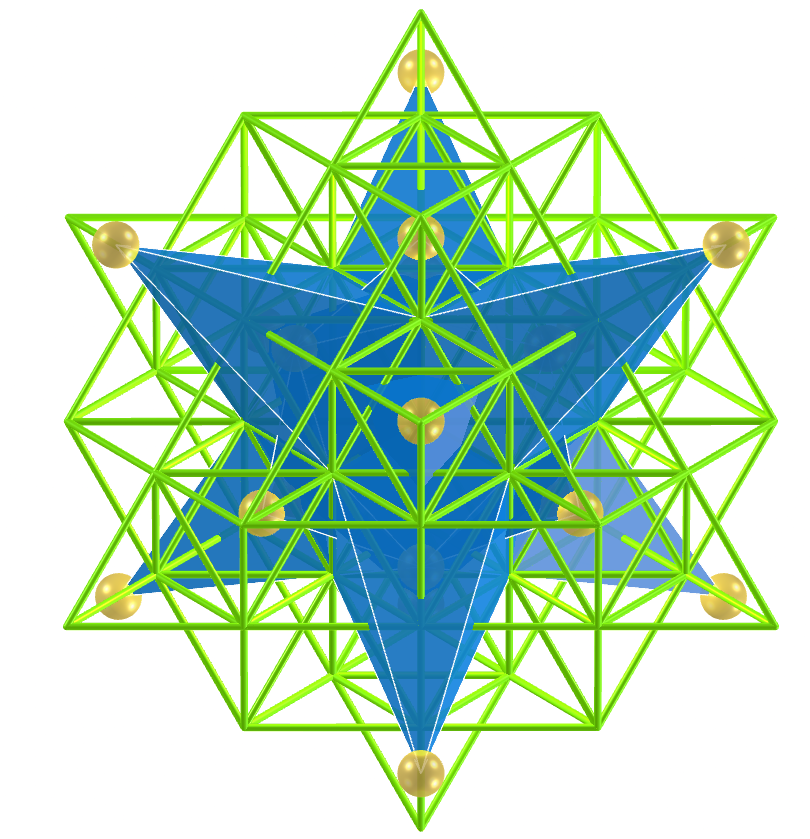</a>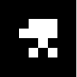
    Alguns exemplos que podemos citar são: na computação, onde o número de 64 bits de memória é essencial; nos jogos clássicos de xadrez ou damas, que possuem 64 casas em seus tabuleiros; ou em textos sagrados do Hinduísmo, que faz referência a 64 tantras. Um grande icositetraedro hexacrônico pode ser inscrito no símbolo da Grade da Vida.
    

<h4>12. Grande rombihexacro</h4>
<a href="../vr/GreatRhombihexacron.htm" target="_blank" title="modelo 3D" class="fotoA">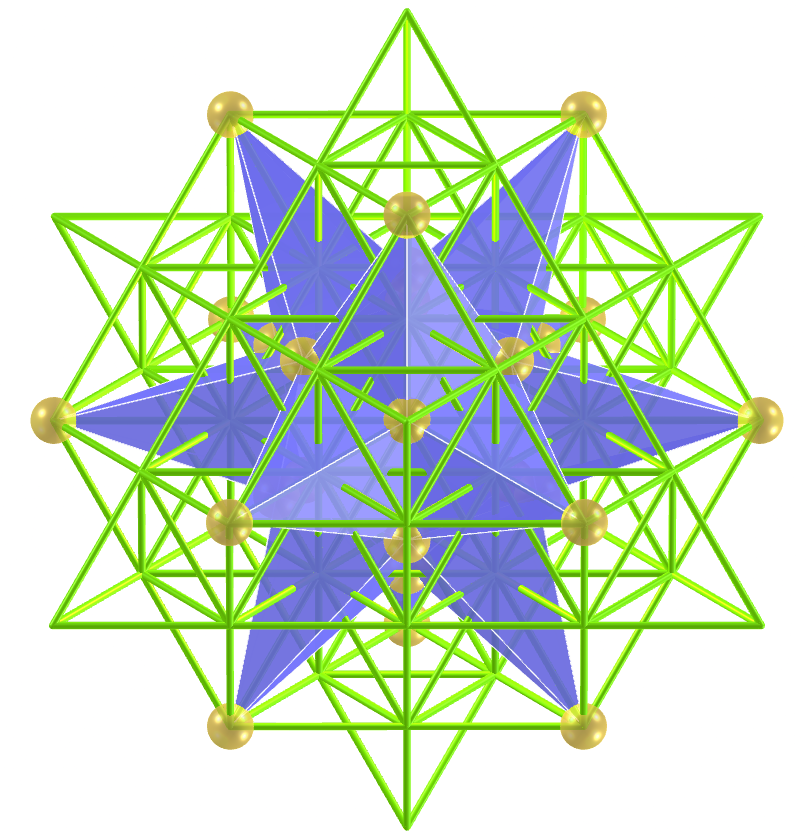</a>
    Grande parte do fascínio do símbolo da Grade da Vida vem do número 64, que surge recorrentemente na natureza, nas construções e no misticismo. Um grande rombihexacro pode ser inscrito no símbolo da Grade da Vida.
    

<h4>13. Grande rombihexaedro</h4>
<a href="../vr/GreatRhombihexahedron.htm" target="_blank" title="modelo 3D" class="fotoA">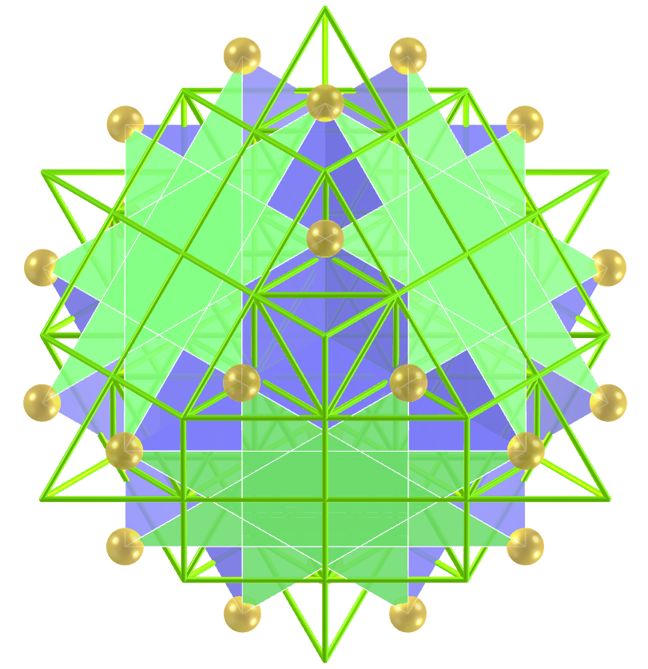</a>
    Alguns exemplos que podemos citar são: na computação, onde o número de 64 bits de memória é essencial; nos jogos clássicos de xadrez ou damas, que possuem 64 casas em seus tabuleiros; ou em textos sagrados do Hinduísmo, que faz referência a 64 tantras. Um grande rombihexaedro pode ser inscrito no símbolo da Grade da Vida.
    

<h4>14. Grande octaedro triakis</h4>
<a href="../vr/GreatTriakisOctahedron.htm" target="_blank" title="modelo 3D" class="fotoA">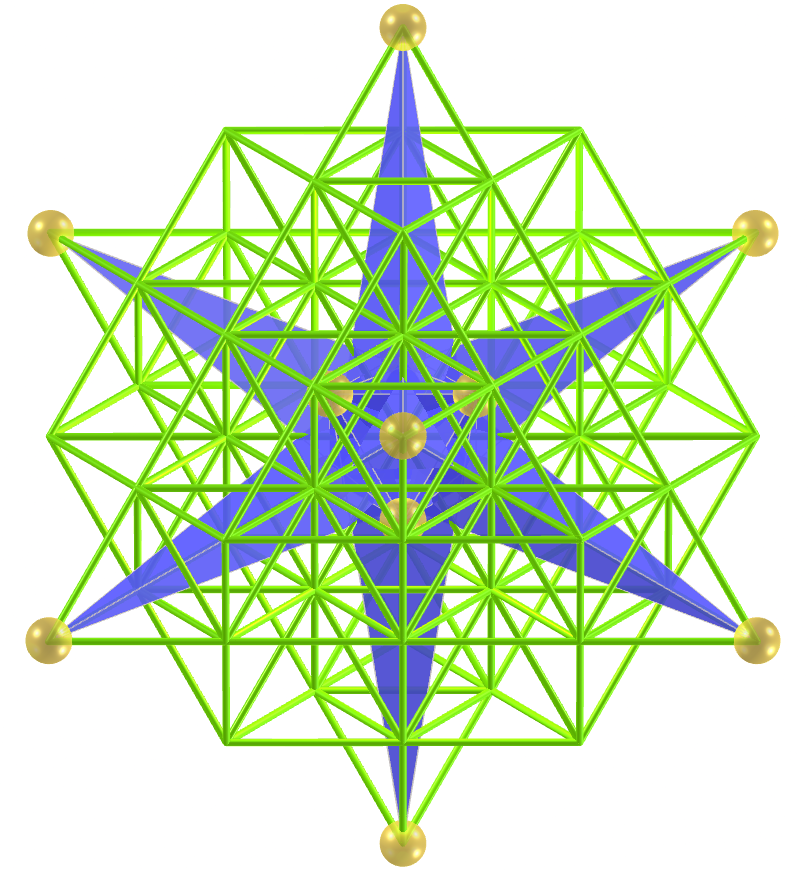</a>
    Grande parte do fascínio do símbolo da Grade da Vida vem do número 64, que surge recorrentemente na natureza, nas construções e no misticismo. Um grande octaedro triakis pode ser inscrito no símbolo da Grade da Vida.
    

<h4>15. Fractal de tristetraedro trapezoédrico</h4>
<a href="../vr/Fractal4.htm" target="_blank" title="modelo 3D" class="fotoA">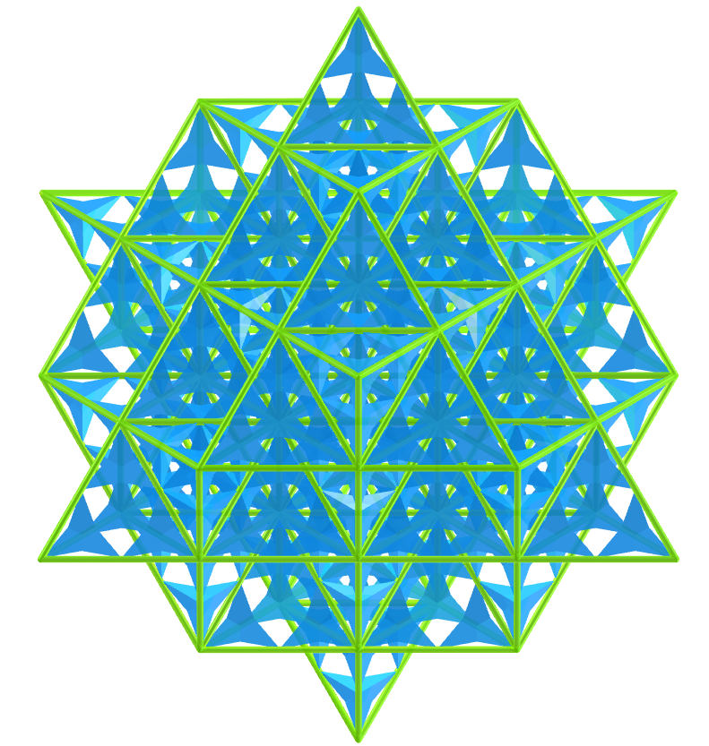</a>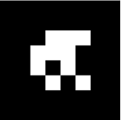
    Alguns exemplos que podemos citar são: na computação, onde o número de 64 bits de memória é essencial; nos jogos clássicos de xadrez ou damas, que possuem 64 casas em seus tabuleiros; ou em textos sagrados do Hinduísmo, que faz referência a 64 tantras. Um fractal de tristetraedro trapezoédrico pode ser circunscrito no símbolo da Grade da Vida.
    

<h4>16. Fractal de tetrahedro hexakis</h4>
<a href="../vr/Fractal5.htm" target="_blank" title="modelo 3D" class="fotoA">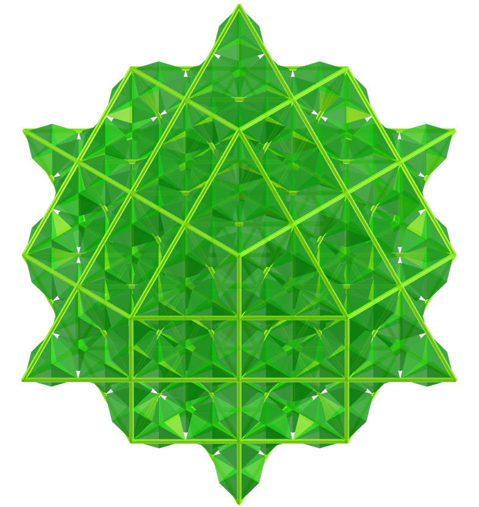</a>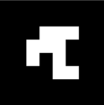
    Grande parte do fascínio do símbolo da Grade da Vida vem do número 64, que surge recorrentemente na natureza, nas construções e no misticismo. Um fractal de tetrahedro hexakis pode ser inscrito no símbolo da Grade da Vida.
    

<h4>17. Grande cuboctaedro truncado</h4>
<a href="../vr/GreatTruncatedCuboctahedron.htm" target="_blank" title="modelo 3D" class="fotoA">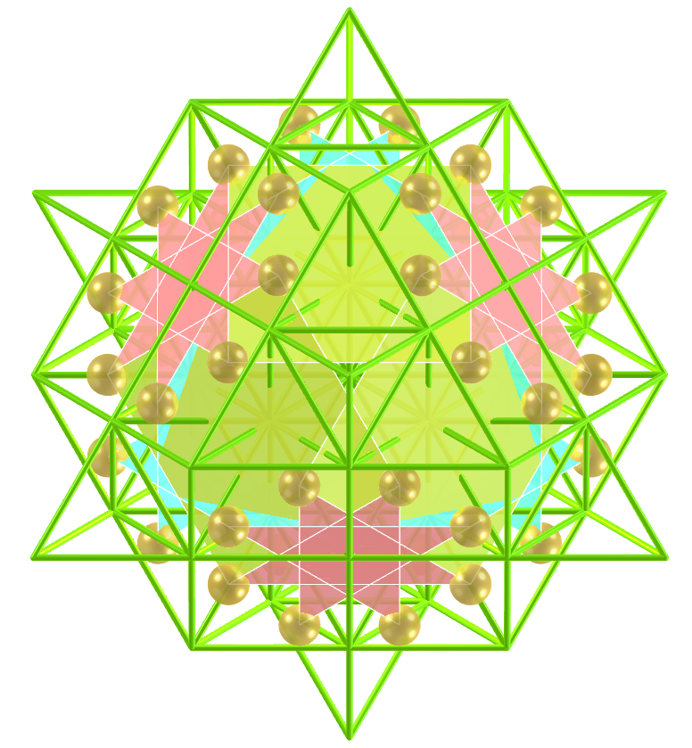</a>
    Alguns exemplos que podemos citar são: na computação, onde o número de 64 bits de memória é essencial; nos jogos clássicos de xadrez ou damas, que possuem 64 casas em seus tabuleiros; ou em textos sagrados do Hinduísmo, que faz referência a 64 tantras. Um grande cuboctaedro truncado pode ser inscrito no símbolo da Grade da Vida.
    

<h4>18. Tetraedro hexakis</h4>
<a href="../vr/HexakisTetrahedron1.htm" target="_blank" title="modelo 3D" class="fotoA">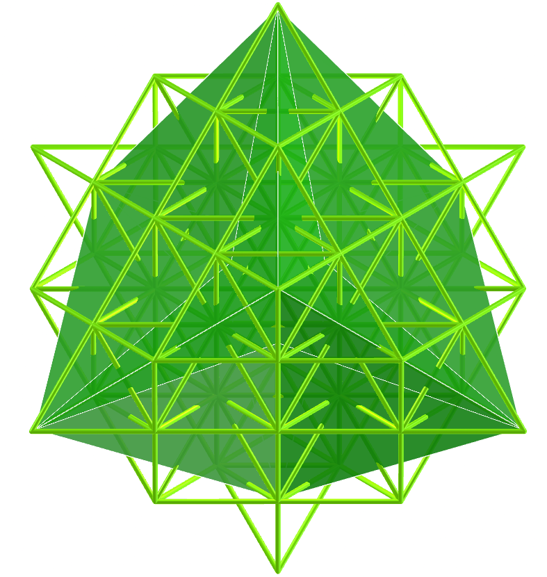</a>
    Grande parte do fascínio do símbolo da Grade da Vida vem do número 64, que surge recorrentemente na natureza, nas construções e no misticismo. Um tetraedro hexakis pode ser inscrito no símbolo da Grade da Vida.
    

<h4>19. Tetraedro hexakis estrelado</h4>
<a href="../vr/HexakisTetrahedron1Star.htm" target="_blank" title="modelo 3D" class="fotoA">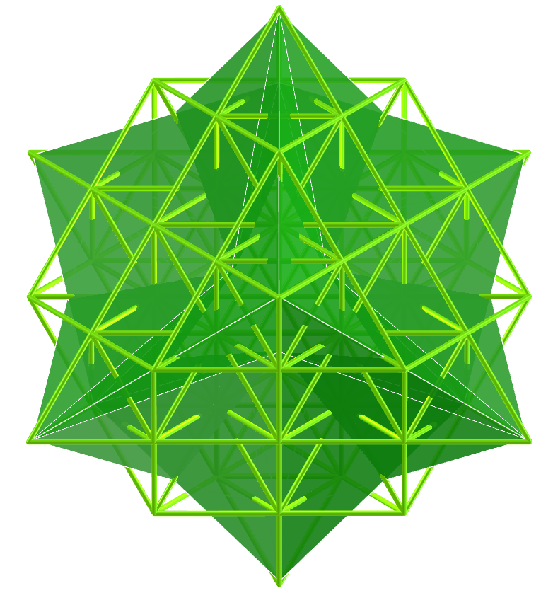</a>
    Alguns exemplos que podemos citar são: na computação, onde o número de 64 bits de memória é essencial; nos jogos clássicos de xadrez ou damas, que possuem 64 casas em seus tabuleiros; ou em textos sagrados do Hinduísmo, que faz referência a 64 tantras. Um tetraedro hexakis estrelado pode ser inscrito no símbolo da Grade da Vida.
    

<h4>20. Tetraedro hexakis</h4>
<a href="../vr/HexakisTetrahedron2.htm" target="_blank" title="modelo 3D" class="fotoA">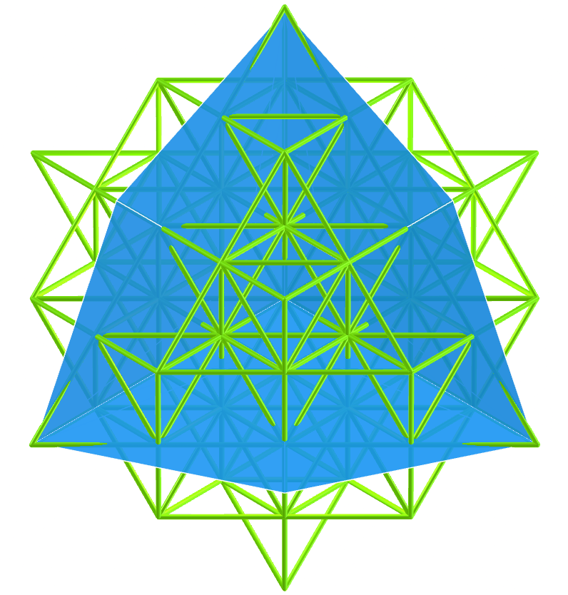</a>
    Alguns exemplos que podemos citar são: na computação, onde o número de 64 bits de memória é essencial; nos jogos clássicos de xadrez ou damas, que possuem 64 casas em seus tabuleiros; ou em textos sagrados do Hinduísmo, que faz referência a 64 tantras. Um tetraedro hexakis pode ser inscrito no símbolo da Grade da Vida.
    

<a href="#p1" class="topo">voltar ao topo</a>

<h4>21. Tetraedro hexakis estrelado</h4>
<a href="../vr/HexakisTetrahedron2Star.htm" target="_blank" title="modelo 3D" class="fotoA">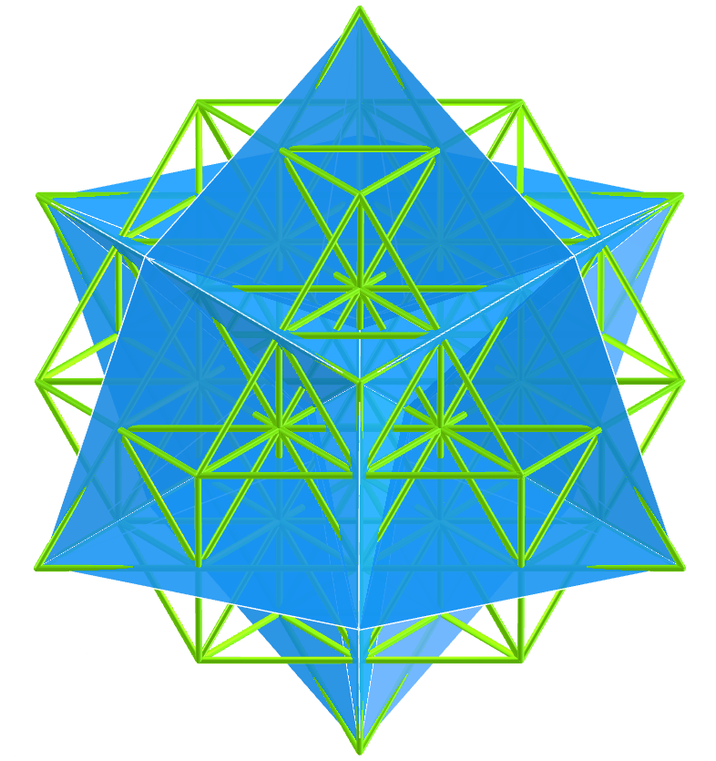</a>
    Alguns exemplos que podemos citar são: na computação, onde o número de 64 bits de memória é essencial; nos jogos clássicos de xadrez ou damas, que possuem 64 casas em seus tabuleiros; ou em textos sagrados do Hinduísmo, que faz referência a 64 tantras. Um tetraedro hexakis estrelado pode ser inscrito no símbolo da Grade da Vida.
    

<h4>22. Tetraedro hexakis</h4>
<a href="../vr/HexakisTetrahedron3.htm" target="_blank" title="modelo 3D" class="fotoA">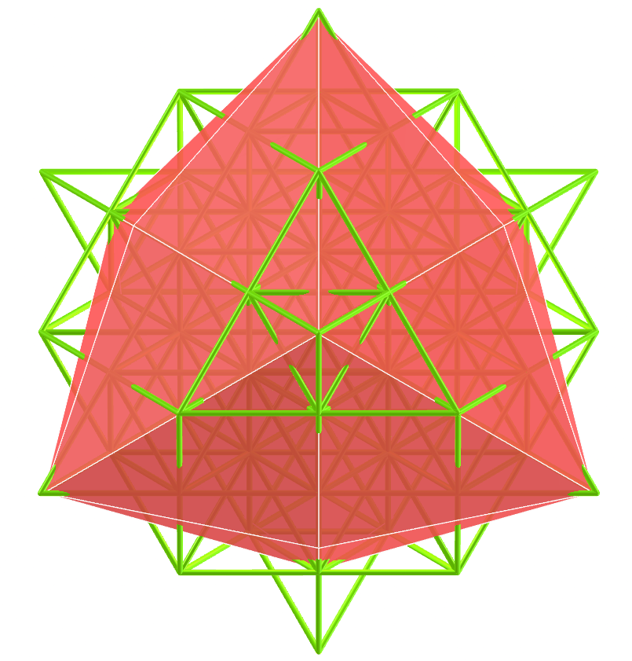</a>
    Grande parte do fascínio do símbolo da Grade da Vida vem do número 64, que surge recorrentemente na natureza, nas construções e no misticismo. Um tetraedro hexakis pode ser inscrito no símbolo da Grade da Vida.
    

<h4>23. Tetraedro hexakis estrelado</h4>
<a href="../vr/HexakisTetrahedron3Star.htm" target="_blank" title="modelo 3D" class="fotoA">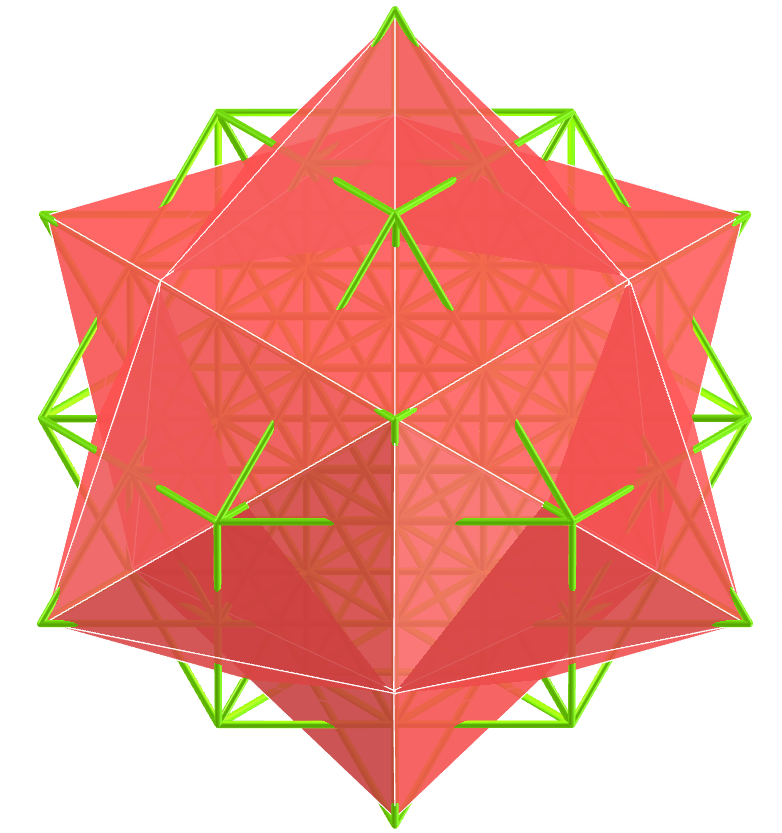</a>
    Alguns exemplos que podemos citar são: na computação, onde o número de 64 bits de memória é essencial; nos jogos clássicos de xadrez ou damas, que possuem 64 casas em seus tabuleiros; ou em textos sagrados do Hinduísmo, que faz referência a 64 tantras. Um tetraedro hexakis estrelado pode ser inscrito no símbolo da Grade da Vida.
    

<h4>24. Tetraedro hexakis</h4>
<a href="../vr/HexakisTetrahedron4.htm" target="_blank" title="modelo 3D" class="fotoA">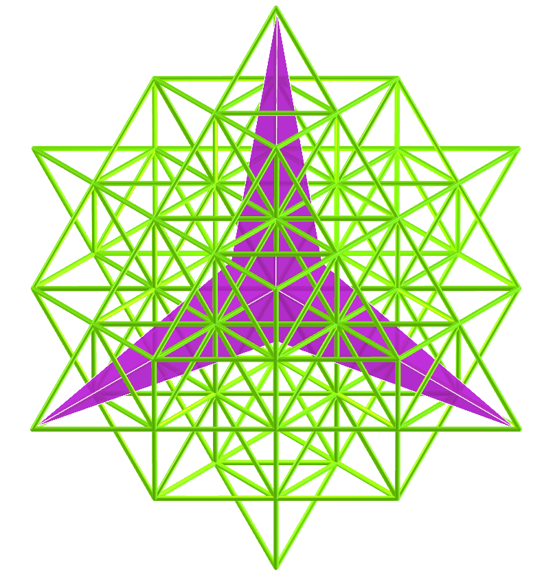</a>
    Grande parte do fascínio do símbolo da Grade da Vida vem do número 64, que surge recorrentemente na natureza, nas construções e no misticismo. Um tetraedro hexakis pode ser inscrito no símbolo da Grade da Vida.
    

<h4>25. Tetraedro hexakis estrelado</h4>
<a href="../vr/HexakisTetrahedron4Star.htm" target="_blank" title="modelo 3D" class="fotoA">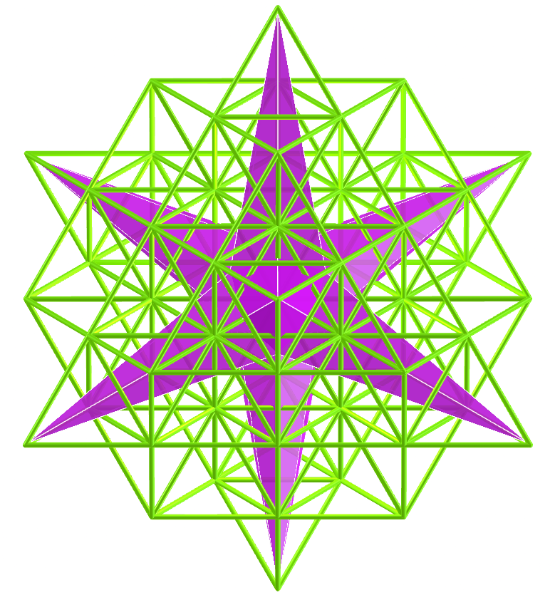</a>
    Alguns exemplos que podemos citar são: na computação, onde o número de 64 bits de memória é essencial; nos jogos clássicos de xadrez ou damas, que possuem 64 casas em seus tabuleiros; ou em textos sagrados do Hinduísmo, que faz referência a 64 tantras. Um tetraedro hexakis estrelado pode ser circunscrito no símbolo da Grade da Vida.
    

<h4>26. Icosaedro de pipas</h4>
<a href="../vr/ico_kites.htm" target="_blank" title="modelo 3D" class="fotoA">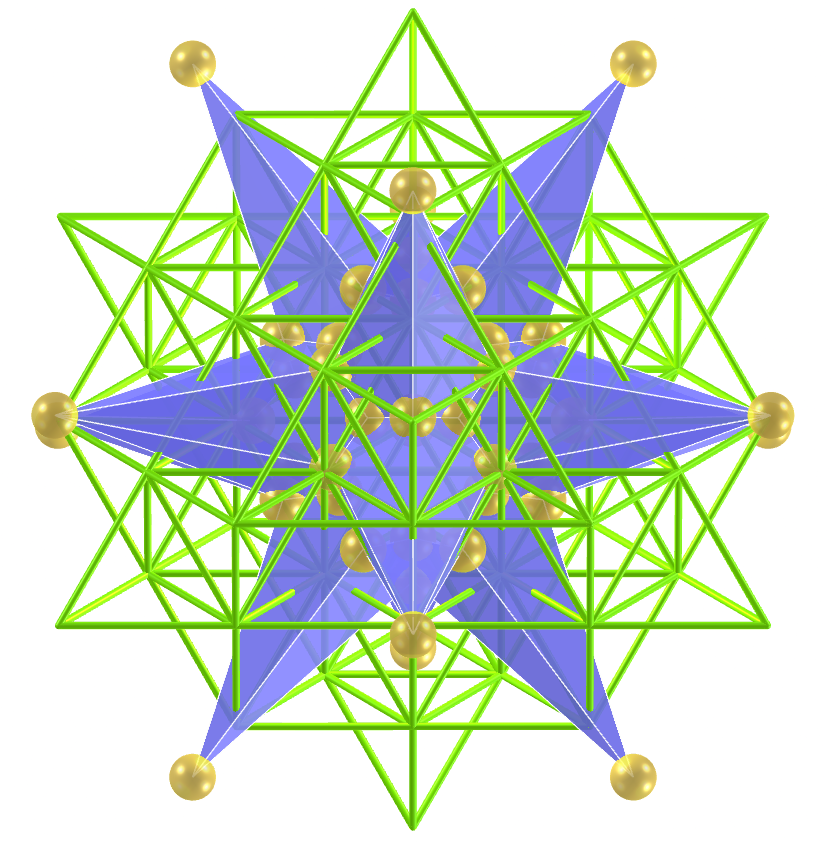</a>
    Grande parte do fascínio do símbolo da Grade da Vida vem do número 64, que surge recorrentemente na natureza, nas construções e no misticismo. Um icosaedro de pipas pode ser inscrito no símbolo da Grade da Vida.
    

<h4>27. Deltaedro de Möbius</h4>
<a href="../vr/Mobius.htm" target="_blank" title="modelo 3D" class="fotoA">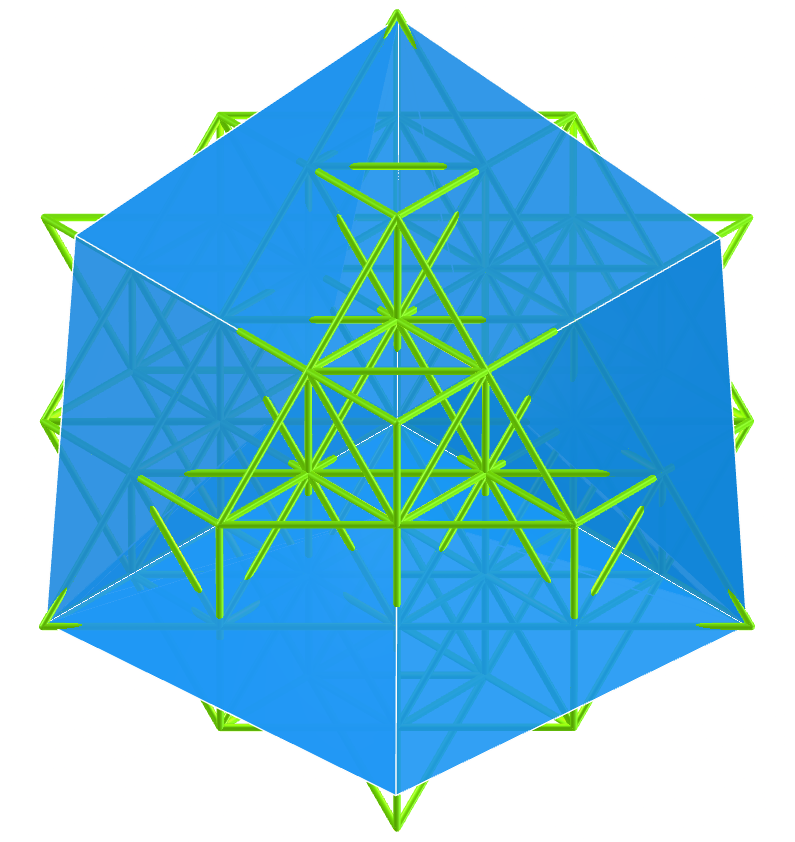</a>
    Alguns exemplos que podemos citar são: na computação, onde o número de 64 bits de memória é essencial; nos jogos clássicos de xadrez ou damas, que possuem 64 casas em seus tabuleiros; ou em textos sagrados do Hinduísmo, que faz referência a 64 tantras. Um deltaedro de Möbius pode ser inscrito no símbolo da Grade da Vida.
    

<h4>28. Deltaedro de Möbius estrelado</h4>
<a href="../vr/MobiusStar.htm" target="_blank" title="modelo 3D" class="fotoA">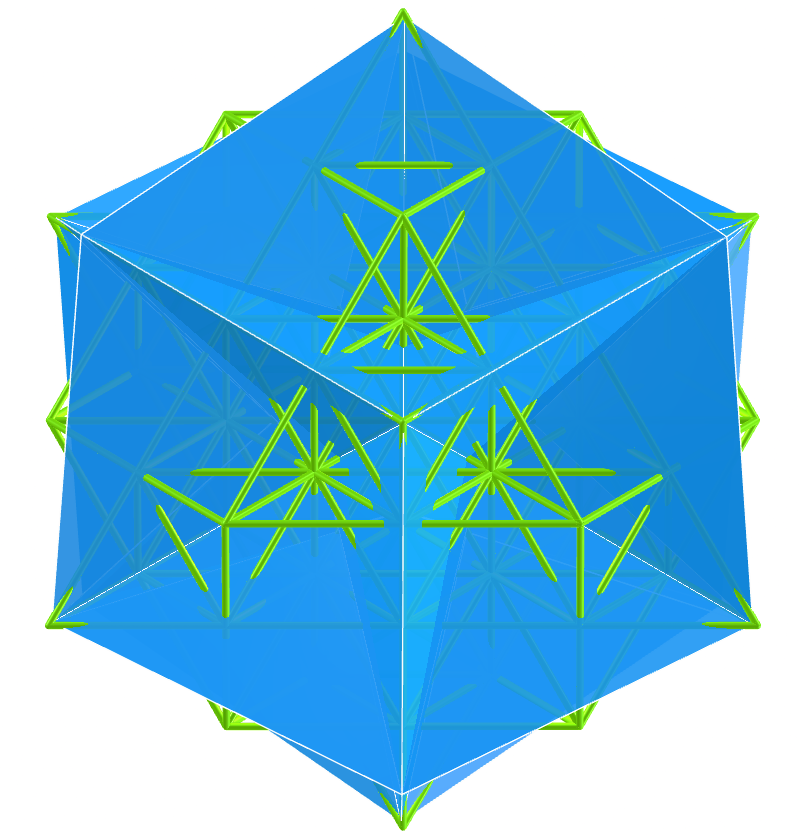</a>
    Grande parte do fascínio do símbolo da Grade da Vida vem do número 64, que surge recorrentemente na natureza, nas construções e no misticismo. Um deltaedro de Möbius estrelado pode ser inscrito no símbolo da Grade da Vida.
    

<h4>29. Octaedro de pipas</h4>
<a href="../vr/octa_kites.htm" target="_blank" title="modelo 3D" class="fotoA">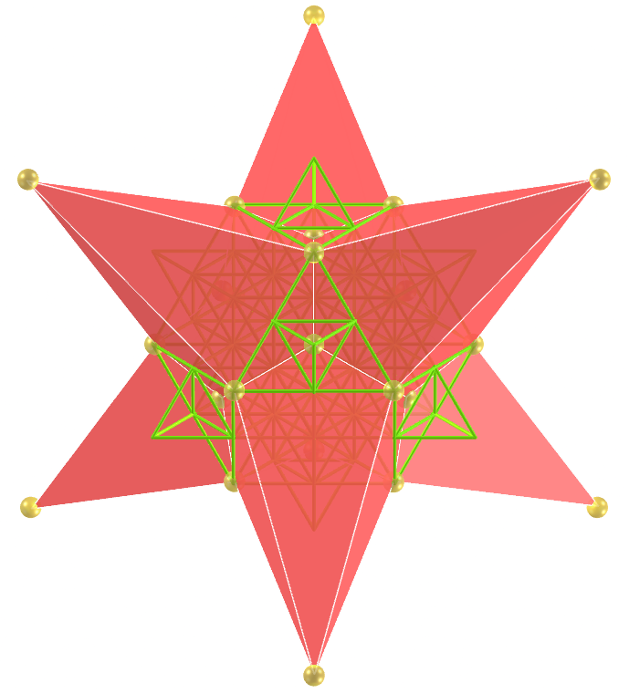</a>
    Alguns exemplos que podemos citar são: na computação, onde o número de 64 bits de memória é essencial; nos jogos clássicos de xadrez ou damas, que possuem 64 casas em seus tabuleiros; ou em textos sagrados do Hinduísmo, que faz referência a 64 tantras. Um octaedro de pipas pode ser inscrito no símbolo da Grade da Vida.
    

<h4>30. Octahemioctaedro</h4>
<a href="../vr/Octahemioctahedron.htm" target="_blank" title="modelo 3D" class="fotoA">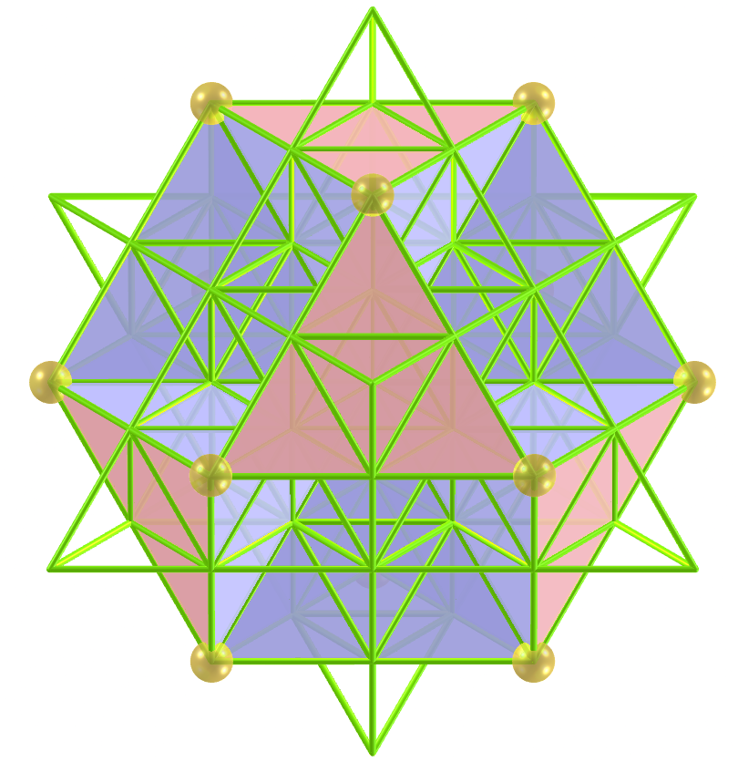</a>
    Alguns exemplos que podemos citar são: na computação, onde o número de 64 bits de memória é essencial; nos jogos clássicos de xadrez ou damas, que possuem 64 casas em seus tabuleiros; ou em textos sagrados do Hinduísmo, que faz referência a 64 tantras. Um octahemioctaedro pode ser inscrito no símbolo da Grade da Vida.
    

<a href="#p1" class="topo">voltar ao topo</a>

<h4>31. Tetraedro hexakis fractal</h4>
<a href="../vr/Fractal6.htm" target="_blank" title="modelo 3D" class="fotoA">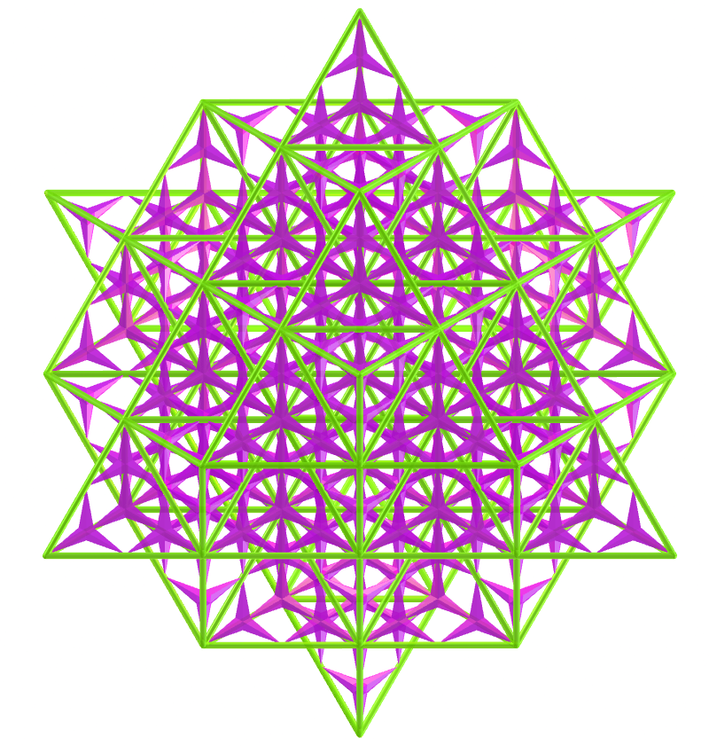</a>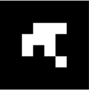
    Alguns exemplos que podemos citar são: na computação, onde o número de 64 bits de memória é essencial; nos jogos clássicos de xadrez ou damas, que possuem 64 casas em seus tabuleiros; ou em textos sagrados do Hinduísmo, que faz referência a 64 tantras. Um tetraedro hexakis fractal pode ser inscrito no símbolo da Grade da Vida.
    

<h4>32. Fractal de tristetraedro trapezoédrico</h4>
<a href="../vr/Fractal7.htm" target="_blank" title="modelo 3D" class="fotoA">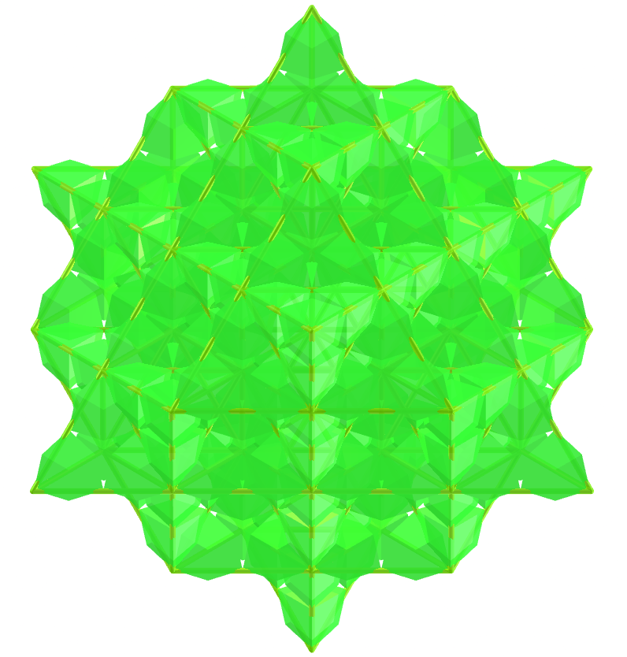</a>
    Grande parte do fascínio do símbolo da Grade da Vida vem do número 64, que surge recorrentemente na natureza, nas construções e no misticismo. Um fractal de tristetraedro trapezoédrico pode ser inscrito no símbolo da Grade da Vida.
    

<h4>33. Pequeno cubicuboctaedro</h4>
<a href="../vr/SmallCubicuboctahedron.htm" target="_blank" title="modelo 3D" class="fotoA">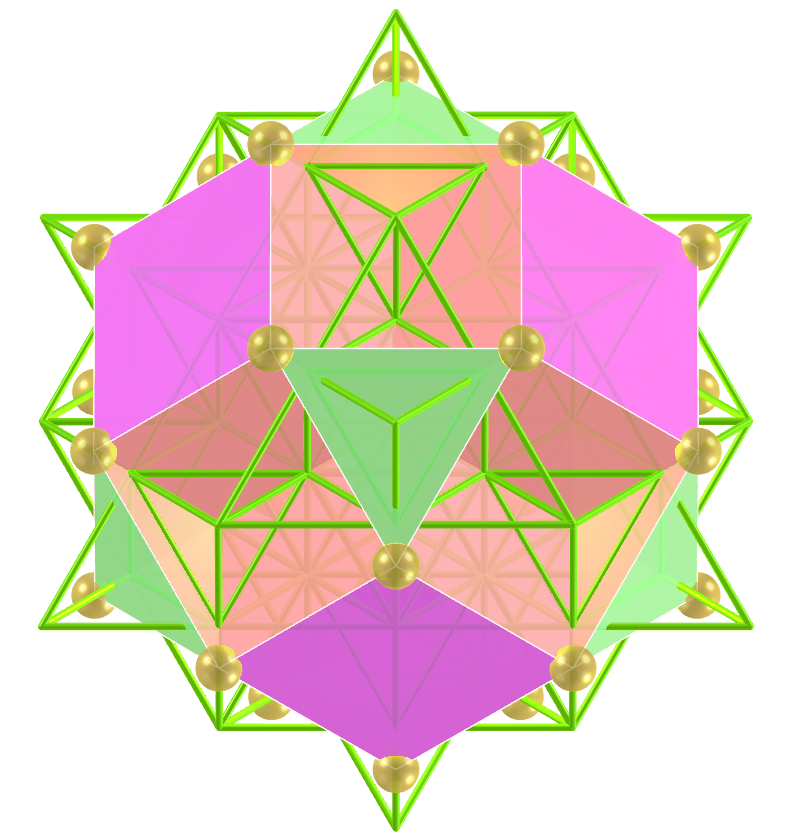</a>
    Alguns exemplos que podemos citar são: na computação, onde o número de 64 bits de memória é essencial; nos jogos clássicos de xadrez ou damas, que possuem 64 casas em seus tabuleiros; ou em textos sagrados do Hinduísmo, que faz referência a 64 tantras. Um pequeno cubicuboctaedro pode ser inscrito no símbolo da Grade da Vida.
    

<h4>34. Pequeno icositetraedro hexacrônico</h4>
<a href="../vr/SmallHexacronicIcositetrahedron.htm" target="_blank" title="modelo 3D" class="fotoA">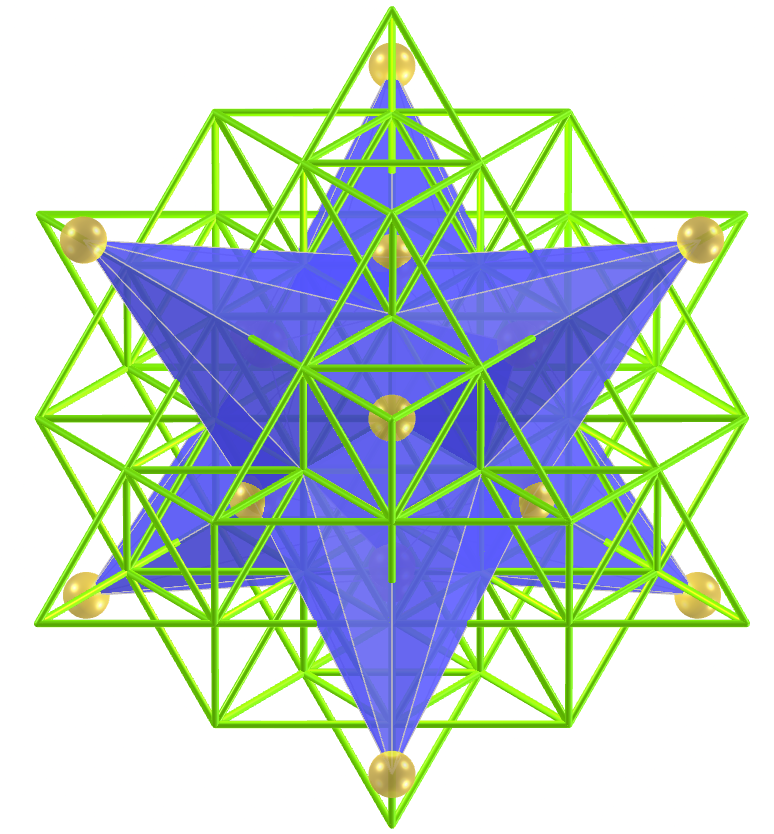</a>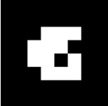
    Grande parte do fascínio do símbolo da Grade da Vida vem do número 64, que surge recorrentemente na natureza, nas construções e no misticismo. Um pequeno icositetraedro hexacrônico pode ser inscrito no símbolo da Grade da Vida.
    

<h4>35. Pequeno rombihexacro</h4>
<a href="../vr/SmallRhombihexacron.htm" target="_blank" title="modelo 3D" class="fotoA">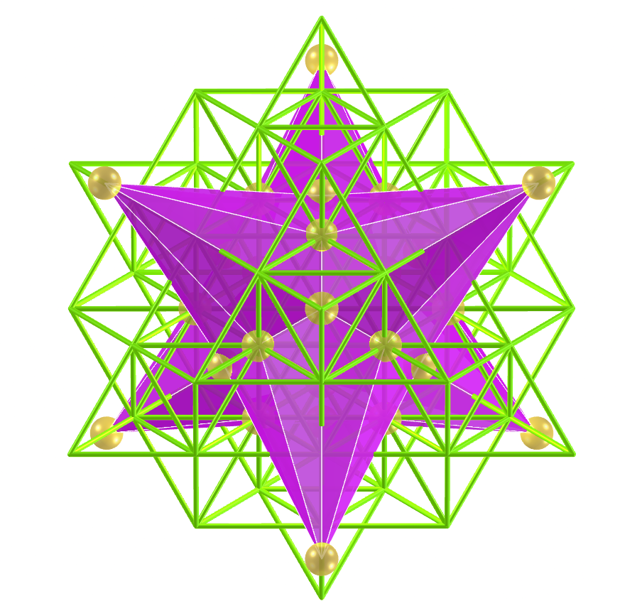</a>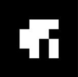
    Alguns exemplos que podemos citar são: na computação, onde o número de 64 bits de memória é essencial; nos jogos clássicos de xadrez ou damas, que possuem 64 casas em seus tabuleiros; ou em textos sagrados do Hinduísmo, que faz referência a 64 tantras. Um pequeno rombihexacro pode ser circunscrito no símbolo da Grade da Vida.
    

<h4>36. Pequeno rombihexaedro</h4>
<a href="../vr/SmallRhombihexahedron.htm" target="_blank" title="modelo 3D" class="fotoA">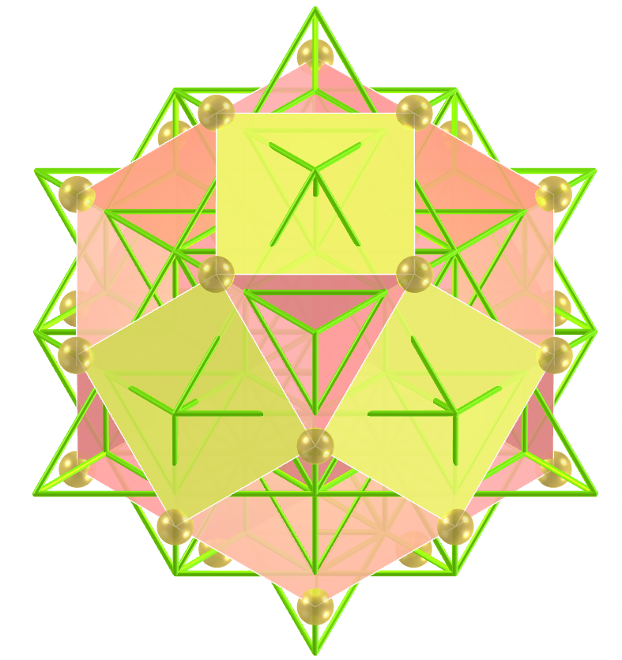</a>
    Grande parte do fascínio do símbolo da Grade da Vida vem do número 64, que surge recorrentemente na natureza, nas construções e no misticismo. Um pequeno rombihexaedro pode ser inscrito no símbolo da Grade da Vida.
    

<h4>37. Hexaedro truncado estrelado</h4>
<a href="../vr/StellatedTruncatedHexahedron.htm" target="_blank" title="modelo 3D" class="fotoA">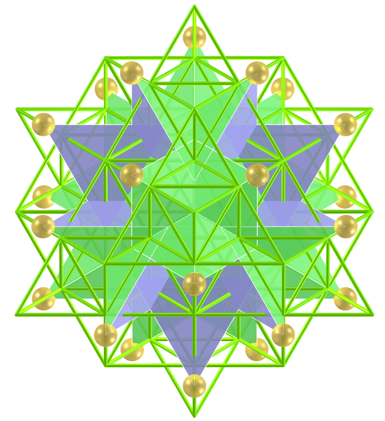</a>
    Alguns exemplos que podemos citar são: na computação, onde o número de 64 bits de memória é essencial; nos jogos clássicos de xadrez ou damas, que possuem 64 casas em seus tabuleiros; ou em textos sagrados do Hinduísmo, que faz referência a 64 tantras. Um hexaedro truncado estrelado pode ser inscrito no símbolo da Grade da Vida.
    

<h4>38. Tetartoide</h4>
<a href="../vr/Tetartoid.htm" target="_blank" title="modelo 3D" class="fotoA">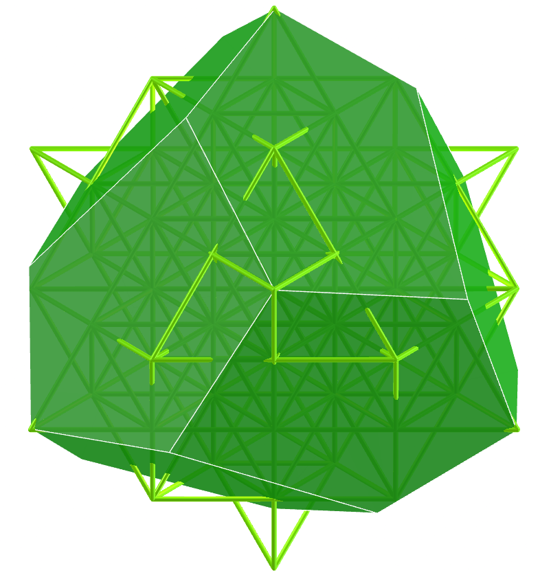</a>
    Grande parte do fascínio do símbolo da Grade da Vida vem do número 64, que surge recorrentemente na natureza, nas construções e no misticismo. Um tetartoide pode ser inscrito no símbolo da Grade da Vida.
    

<h4>39. Tetartoide estrelado</h4>
<a href="../vr/TetartoidStar.htm" target="_blank" title="modelo 3D" class="fotoA">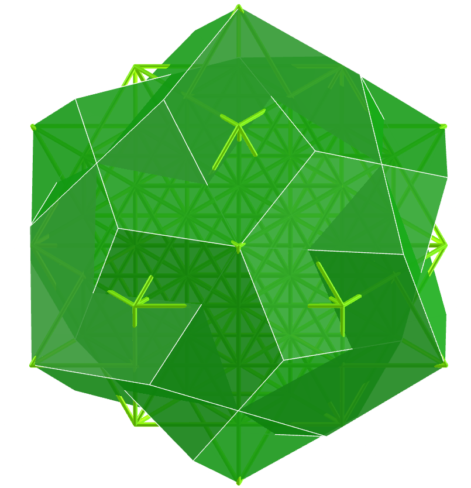</a>
    Alguns exemplos que podemos citar são: na computação, onde o número de 64 bits de memória é essencial; nos jogos clássicos de xadrez ou damas, que possuem 64 casas em seus tabuleiros; ou em textos sagrados do Hinduísmo, que faz referência a 64 tantras. Um tetartoide estrelado pode ser inscrito no símbolo da Grade da Vida.
    

<h4>40. Hexaedro tetradiakis</h4>
<a href="../vr/TetradyakisHexahedron.htm" target="_blank" title="modelo 3D" class="fotoA">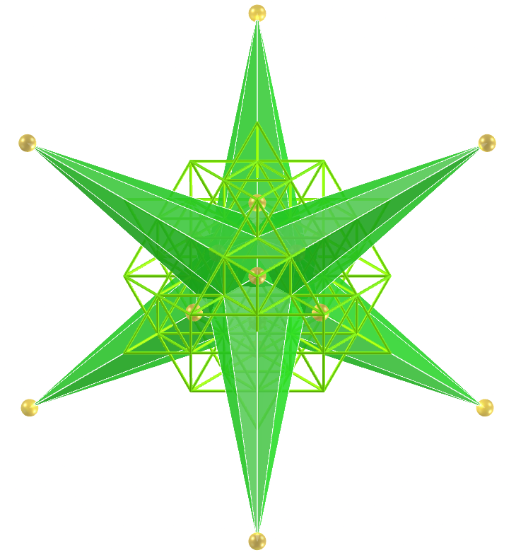</a>
    Alguns exemplos que podemos citar são: na computação, onde o número de 64 bits de memória é essencial; nos jogos clássicos de xadrez ou damas, que possuem 64 casas em seus tabuleiros; ou em textos sagrados do Hinduísmo, que faz referência a 64 tantras. Um hexaedro tetradiakis pode ser inscrito no símbolo da Grade da Vida.
    

<a href="#p1" class="topo">voltar ao topo</a>

<h4>41. Tetrahemihexaedro</h4>
<a href="../vr/Tetrahemihexahedron.htm" target="_blank" title="modelo 3D" class="fotoA">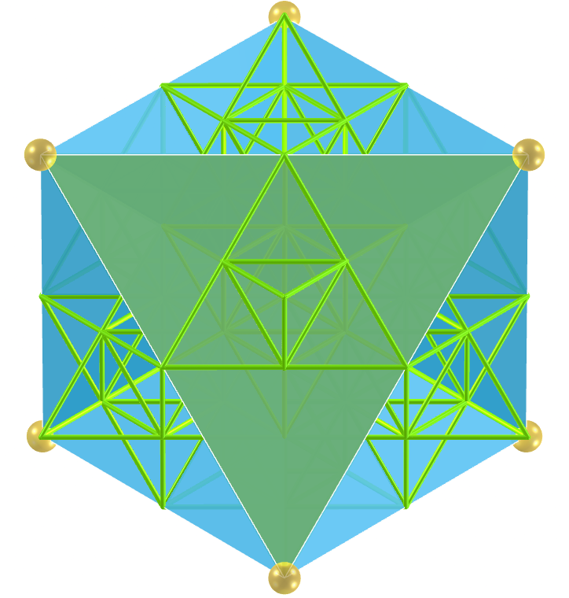</a>
    Alguns exemplos que podemos citar são: na computação, onde o número de 64 bits de memória é essencial; nos jogos clássicos de xadrez ou damas, que possuem 64 casas em seus tabuleiros; ou em textos sagrados do Hinduísmo, que faz referência a 64 tantras. Um tetrahemihexaedro pode ser inscrito no símbolo da Grade da Vida.
    

<h4>42. Tristetraedro trapezoédrico</h4>
<a href="../vr/TrapezohedralTristetrahedron.htm" target="_blank" title="modelo 3D" class="fotoA">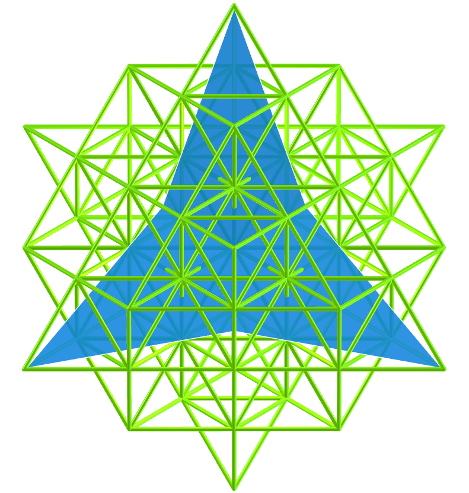</a>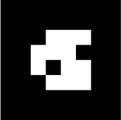
    Grande parte do fascínio do símbolo da Grade da Vida vem do número 64, que surge recorrentemente na natureza, nas construções e no misticismo. Um tristetraedro trapezoédrico pode ser inscrito no símbolo da Grade da Vida.
    

<h4>43. Tristetraedro trapezoédrico estrelado</h4>
<a href="../vr/TrapezohedralTristetrahedronStar.htm" target="_blank" title="modelo 3D" class="fotoA">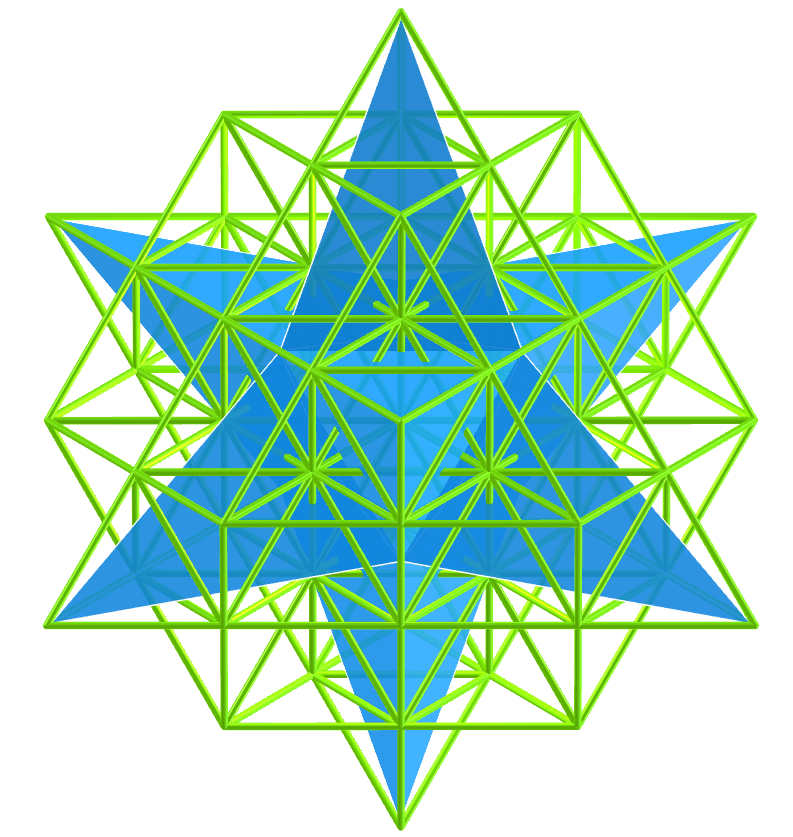</a>
    Alguns exemplos que podemos citar são: na computação, onde o número de 64 bits de memória é essencial; nos jogos clássicos de xadrez ou damas, que possuem 64 casas em seus tabuleiros; ou em textos sagrados do Hinduísmo, que faz referência a 64 tantras. Um pequeno cubicuboctaedro pode ser inscrito no símbolo da Grade da Vida.
    

<h4>44. Tristetraedro trapezoédrico</h4>
<a href="../vr/TrapezohedralTristetrahedron2.htm" target="_blank" title="modelo 3D" class="fotoA">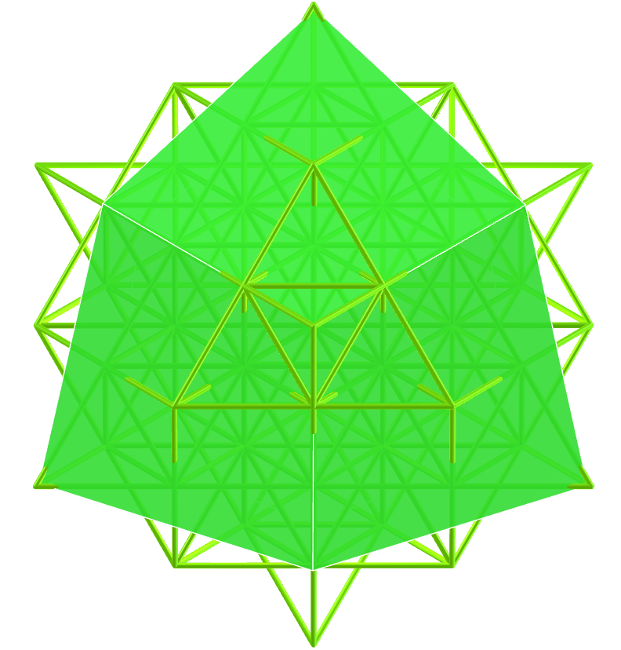</a>
    Grande parte do fascínio do símbolo da Grade da Vida vem do número 64, que surge recorrentemente na natureza, nas construções e no misticismo. Um tristetraedro trapezoédrico pode ser inscrito no símbolo da Grade da Vida.
    

<h4>45. Tristetraedro trapezoédrico estrelado</h4>
<a href="../vr/TrapezohedralTristetrahedron2Star.htm" target="_blank" title="modelo 3D" class="fotoA">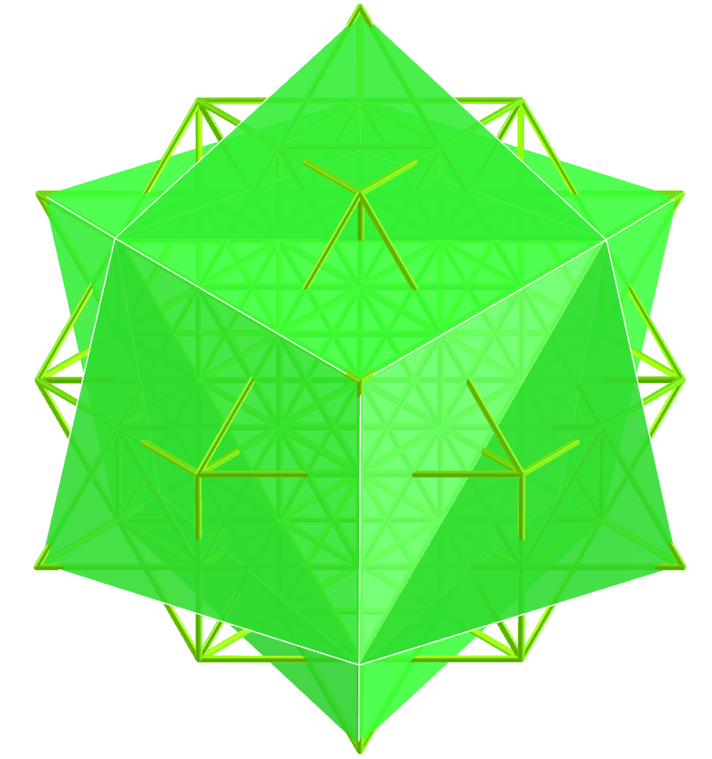</a>
    Alguns exemplos que podemos citar são: na computação, onde o número de 64 bits de memória é essencial; nos jogos clássicos de xadrez ou damas, que possuem 64 casas em seus tabuleiros; ou em textos sagrados do Hinduísmo, que faz referência a 64 tantras. Um tristetraedro trapezoédrico estrelado pode ser circunscrito no símbolo da Grade da Vida.
    

<h4>46. Grande rombicuboctaedro uniforme</h4>
<a href="../vr/UniformGreatRhombicuboctahedron.htm" target="_blank" title="modelo 3D" class="fotoA">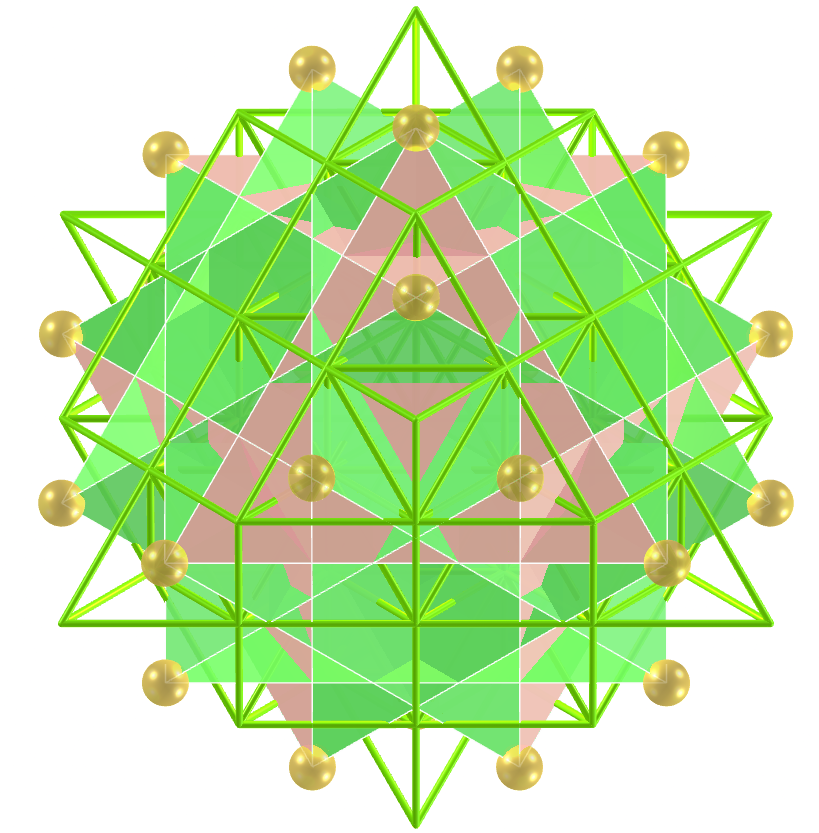</a>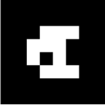
    Grande parte do fascínio do símbolo da Grade da Vida vem do número 64, que surge recorrentemente na natureza, nas construções e no misticismo. Um grande rombicuboctaedro uniforme pode ser inscrito no símbolo da Grade da Vida.
    

<h4>47. Deltaedro de Möbius fractal</h4>
<a href="../vr/Fractal8.htm" target="_blank" title="modelo 3D" class="fotoA">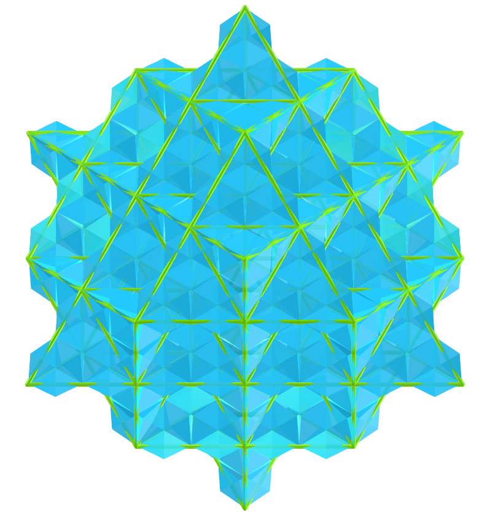</a>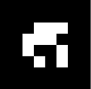
    Alguns exemplos que podemos citar são: na computação, onde o número de 64 bits de memória é essencial; nos jogos clássicos de xadrez ou damas, que possuem 64 casas em seus tabuleiros; ou em textos sagrados do Hinduísmo, que faz referência a 64 tantras. Um deltaedro de Möbius fractal pode ser inscrito no símbolo da Grade da Vida.
    

<h4>48. Tetartoide fractal</h4>
<a href="../vr/Fractal9.htm" target="_blank" title="modelo 3D" class="fotoA">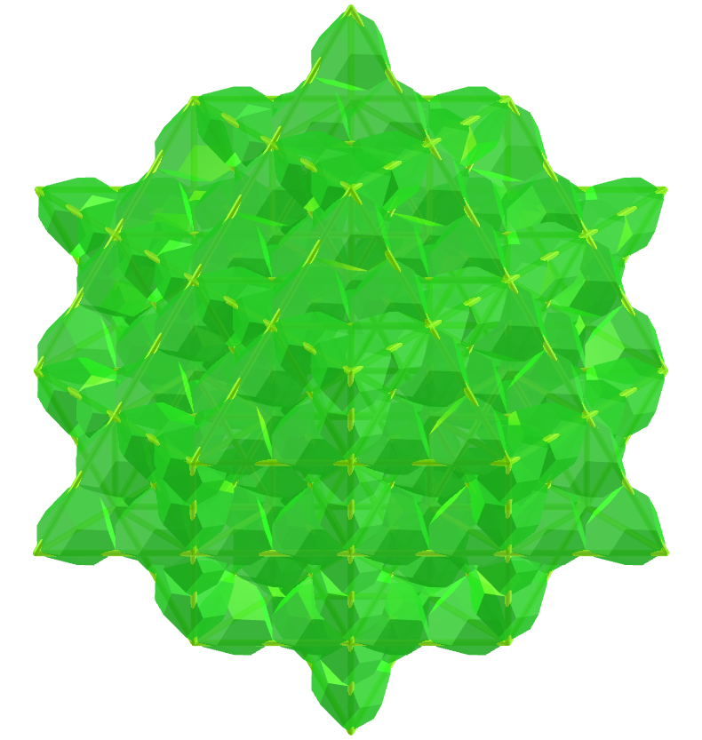</a>
    Grande parte do fascínio do símbolo da Grade da Vida vem do número 64, que surge recorrentemente na natureza, nas construções e no misticismo. Um tetartoide fractal pode ser inscrito no símbolo da Grade da Vida.
    

<a href="#p1" class="topo">voltar ao topo</a>

  Grid of life and nonconvex polyhedra: Visualization of symbols with Augmented Reality and Virtual Reality de <a xmlns:cc="http://creativecommons.org/ns#" href="https://paulohscwb.github.io/grid-of-life/nonconvex/pt-br/" property="cc:attributionName" rel="cc:attributionURL">Paulo Henrique Siqueira</a> está licenciado com uma Licença <a rel="license" href="http://creativecommons.org/licenses/by-nc-nd/4.0/">Creative Commons Atribuição-NãoComercial-SemDerivações 4.0 Internacional</a>.

<h4>Como citar este trabalho:</h4> 

Siqueira, P.H., "Grid of life and nonconvex polyhedra: Visualization of symbols with Augmented Reality and Virtual Reality". Disponível em: <https://paulohscwb.github.io/grid-of-life/nonconvex/pt-br/>, Junho de 2026.

<!---->
  <b>Referências:</b>
 Pardesco. "Sacred Geometry Art, Symbols & Meanings". <a href="https://pardesco.com/blogs/news/sacred-geometry-art-symbols-meanings" target="_blank">https://pardesco.com/blogs/news/sacred-geometry-art-symbols-meanings</a>
 Weisstein, Eric W. "Polyhedra" From MathWorld-A Wolfram Web Resource. <a href="https://mathworld.wolfram.com/topics/Polyhedra.html" target="_blank">https://mathworld.wolfram.com/topics/Polyhedra.html</a>
 Solar System Scope. "Solar Textures: Stars and Milky Way". <a href="https://www.solarsystemscope.com/textures/" target="_blank">https://www.solarsystemscope.com/textures/</a>
 McCooey, D. I. "Visual Polyhedra". <a href="http://dmccooey.com/polyhedra/" target="_blank">http://dmccooey.com/polyhedra/</a>
